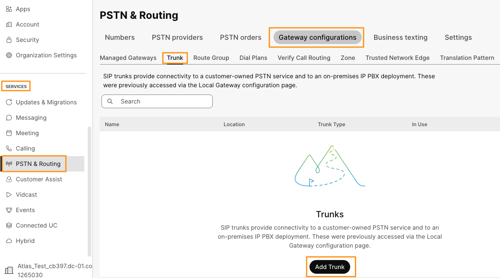
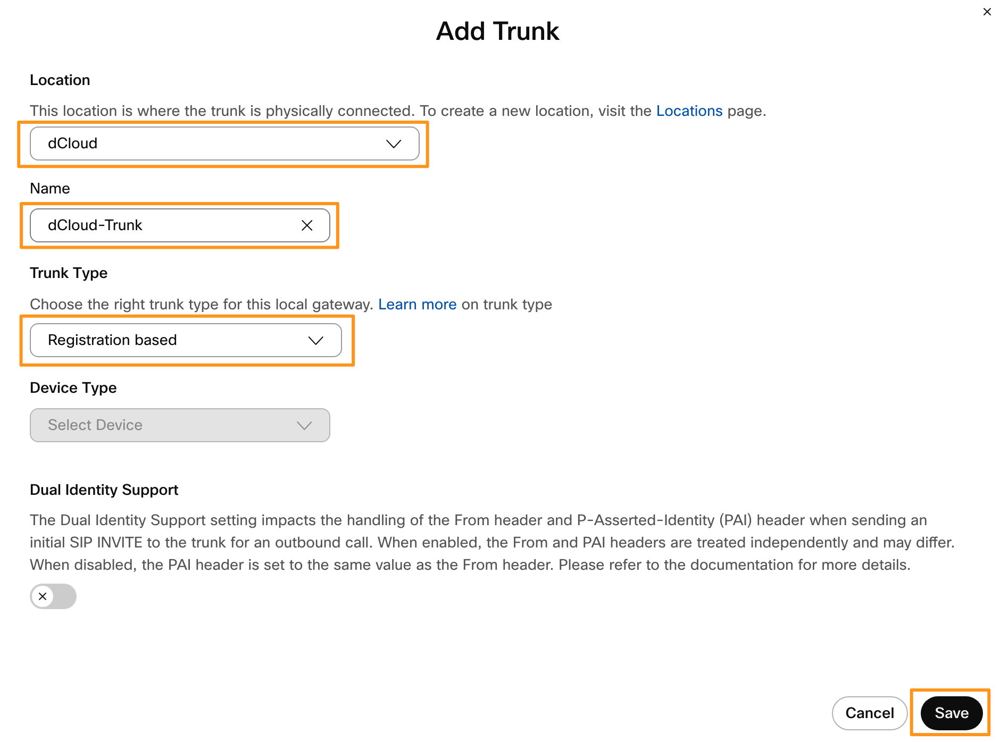
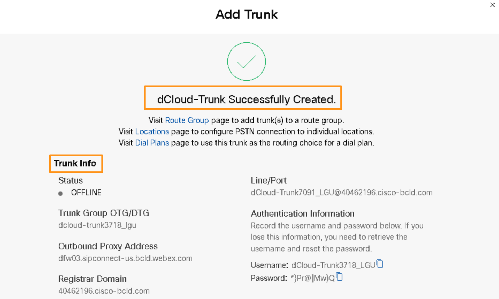

# Adding Trunk to Control Hub

## Registration-based Trunking – Adding a Trunk in Control Hub

The first task is to create a Trunk in the Control Hub. You will need the information provided after creating the Trunk to build your local gateway.

* Continuing on Workstation 1, Go back to the browser where you have logged in to Webex Control Hub before.

* Go to <strong>SERVICES</strong> &gt; <strong>PSTN &amp; Routing</strong>. On the page, go to the <strong>Gateway Configurations</strong> tab and click the <strong>Trunk</strong> page and click <strong>Add Trunk</strong>.

* On the <strong>Add Trunk</strong> pop-up window populate the following information and click <strong>Save</strong>.

| <strong>Parameter Name</strong> | <strong>Parameter Value</strong> |
| --- | --- |
| Location | drop down and choose <strong>dCloud</strong> |
| Name | <strong>dCloud-Trunk</strong> or something you like (<strong>DO NOT</strong> use an underscore “\_” in the name) |
| Trunk Type | Registration based |
| Dual Identity Support | Leave <strong>Default</strong> |
| P-Charge-Info Support | Leave <strong>Default</strong> |

* The trunk will be added, and some configuration information will be displayed on the page. You will need this information to configure the local gateway platform later. <strong>DO NOT CLOSE THIS WINDOW WITHOUT CAPTURING THIS CONFIGURATION INFORMATION</strong>. It is recommended to create the Lab\_info.txt document (or use a previously created one) on Workstation 1 and copy the information there. You will need the Registrar Domain, Trunk Group OTG/DTG, Line/Port, and Outbound Proxy Address.

* Click the X to close out the window <strong>after capturing</strong> the information.
