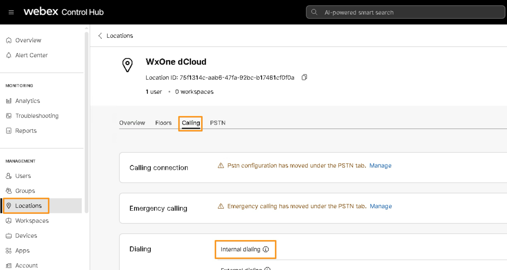
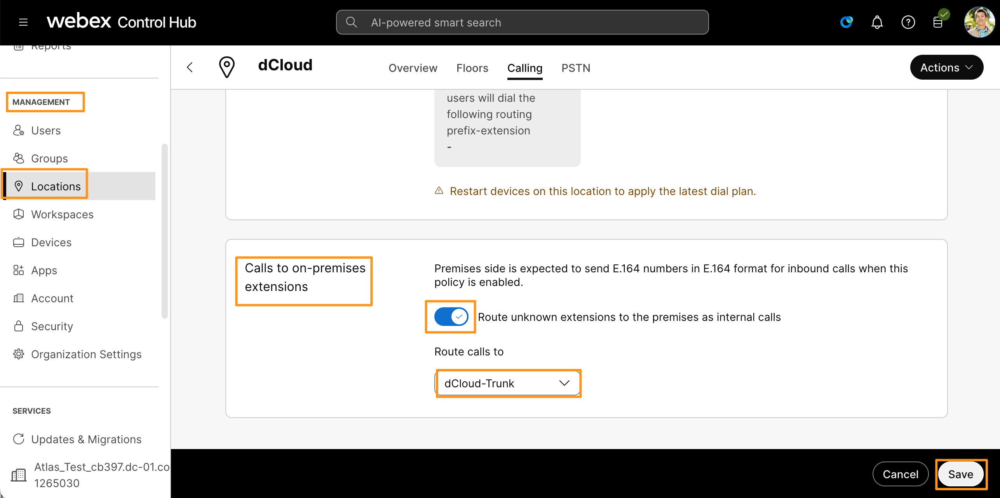
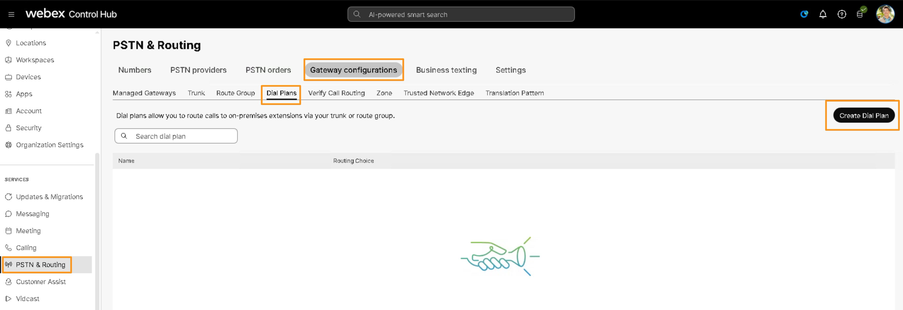
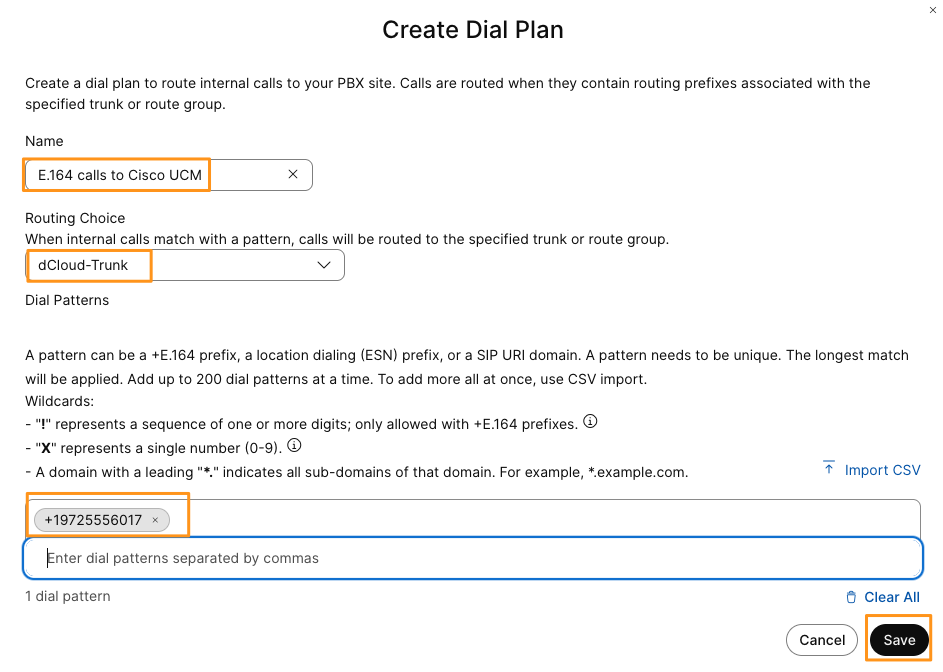
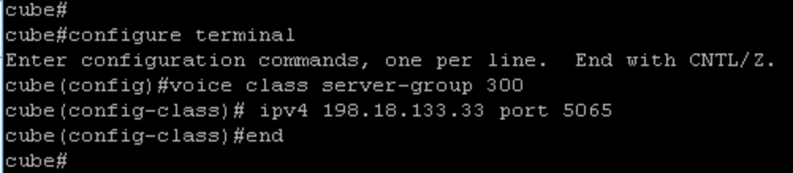
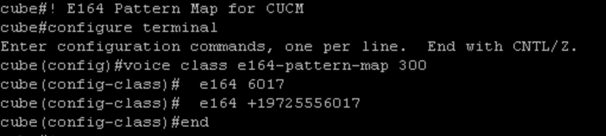
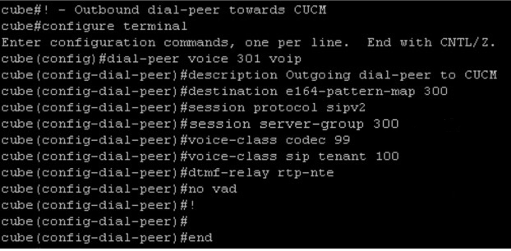
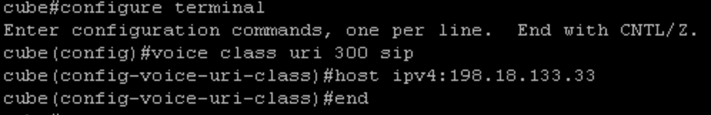
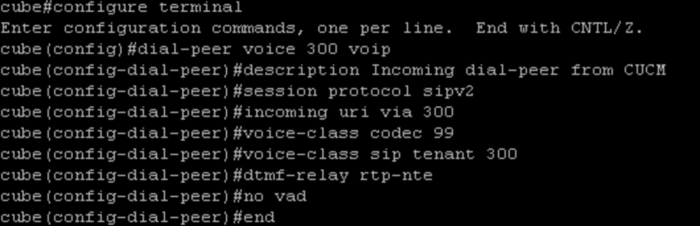

# Setup Call Routing

## Outbound Call Routing from Webex Calling Multi-tenant to On-Prem CUCM

The Webex Calling user can dial the On-prem CUCM user using an internal extension or using E164 number. We already have pre-configured On-prem CUCM Jabber user Anita Perez with Extension 6017 and E164 number +19725556017

* On Workstation 1, go back to browser tab where you have Webex Control Hub logged in.  If the previous login timed out login as [<strong>cholland@cbXXX.dc-YY.com</strong>](mailto:cholland@cbXXX.dc-YY.com) and <strong>dCloudZZZZ!</strong>

* Navigate to <strong>MANAGEMENT</strong> &gt; <strong>Locations</strong>. Select the Location <strong>dCloud</strong><strong>.  </strong>On the dCloud location page go to <strong>Calling</strong> tab.  and click on <strong>Calling</strong> &gt; <strong>Internal Dialing</strong><strong>.</strong>



* Scroll down to the section <strong>Calls to on-premises extensions</strong>. <strong>Enable</strong> the toggle for <strong>Route unknown extensions to the premises as internal calls</strong>. Drop-down the option for <strong>Route calls to</strong> &amp; choose <strong>dCloud-Trunk</strong>.  Click <strong>Save</strong>.

What this setting does is, for calls to any unknown extensions that are not present in the Webex Calling dial-plan – we will send the call to the Trunk chosen as an On-premises extension call.



* Now, we will create a dial-plan for the E164 number. Navigate to <strong>SERVICES</strong> &gt; <strong>PSTN &amp; Routing</strong>.  On the <strong>PSTN &amp; Routing</strong> page go to <strong>Gateway Configurations</strong> &gt; <strong>Dial Plans</strong> &amp; click <strong>Create Dial Plan</strong>



* It will bring up new pop-up window to <strong>Create Dial Plan</strong>.  On the pop-up window configure the following parameters and click <strong>Save</strong>.

- Name: <strong>E.164 calls to Cisco UCM</strong> (or anything descriptive you like)

- Routing Choice: drop down and choose <strong>dCloud-Trunk</strong>

- Dial Patterns: <strong>+19725556017</strong>



## Configure Dial-Peer(s) and Call Routing in the Gateway for calls to and from On-prem CUCM

* Now go back to putty session where you have logged into cube.  Login back in with credentials admin/dCloud123! If previous login timed out.

* Configure the following Outbound Server-group, E164 pattern map containing CUCM numbers and Outbound Dial-peer to CUCM

<strong>Configuration:</strong>

! Outbound Server group to CUCM

```text
configure terminal 
voice class server-group 300
 ipv4 198.18.133.33 port 5065
end 
```



! E164 Pattern Map for CUCM

```text
configure terminal
voice class e164-pattern-map 300
  e164 6017
  e164 +19725556017
end
```



! Outbound dial-peer to CUCM

```text
configure terminal
dial-peer voice 301 voip
description Outgoing dial-peer to CUCM
destination e164-pattern-map 300
session protocol sipv2
session server-group 300
voice-class codec 99
voice-class sip tenant 100
dtmf-relay rtp-nte
no vad
end
```



* Configure the following URI for inbound dial-peer matching from CUCM and Inbound Dial-peer from CUCM

<strong>Configuration:</strong>

! Inbound voice class URI from CUCM

```text
configure terminal 
voice class uri 300 sip
host ipv4:198.18.133.33
end 
```



! Inbound dial peer match from CUCM

```text
configure terminal 
dial-peer voice 300 voip
description Incoming dial-peer from CUCM
session protocol sipv2
incoming uri via 300
voice-class codec 99
voice-class sip tenant 300
dtmf-relay rtp-nte
no vad
end 
```


