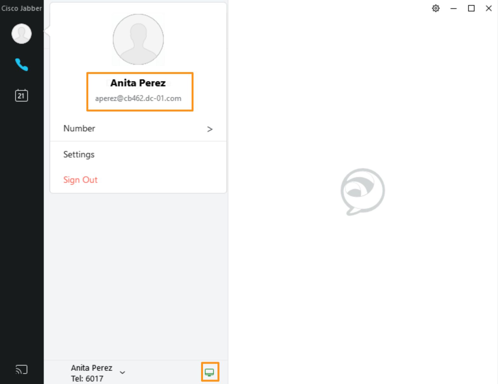
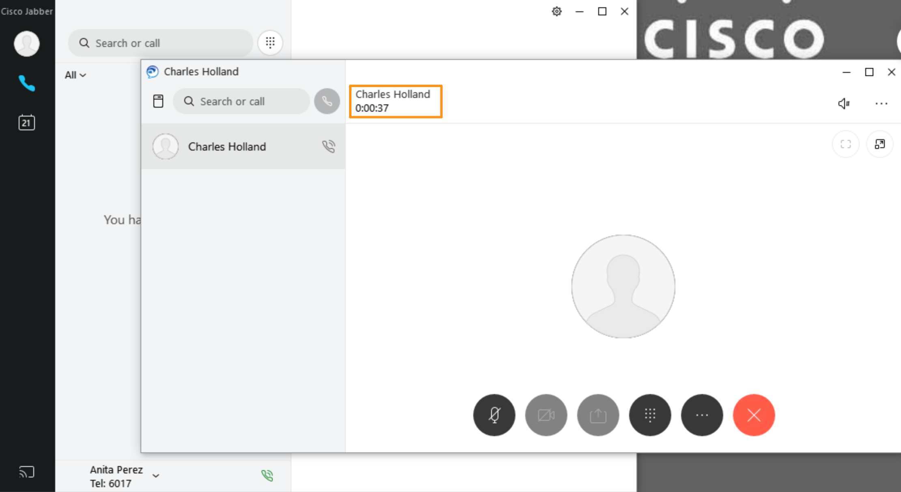
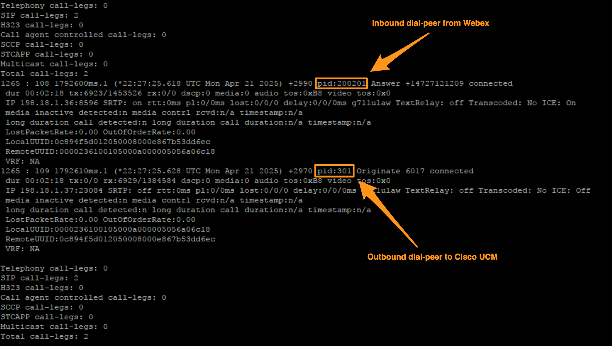
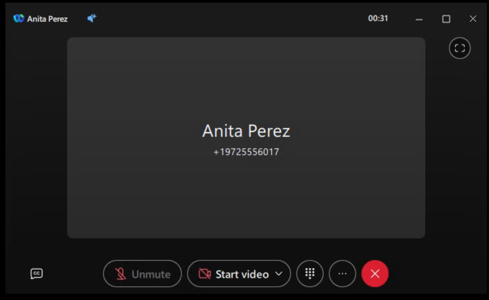

# Test Calls with CUCM User(s) with and without Survivability event

## Test calls between On-prem CUCM user and Webex Calling user

* Before we try the call, let's first login to Cisco Jabber on Workstation 2.  Open WebRDP connection to Workstation 2 at 198.18.1.37 using the credentials dcloud\\aperez &amp; dCloud123!

* Once logged in to workstation 2, launch Cisco Jabber from Desktop.  Jabber should auto login.

!!! note "Note"

    If Jabber is not auto logged  in,  Enter the email [aperez@dcloud.cisco.com](mailto:aperez@dcloud.cisco.com) and click Continue. On the next screen enter username as <strong>aperez </strong>and password as <strong>dCloud123!.  </strong>Click Login.  Once logged in the phone services should be automatically connected.

* Go back to Workstation 1 and from Webex dial the Anita Perez phone number <strong>+19725556017</strong> or extension <strong>6017</strong>

* Answer the call on Workstation 2 Jabber.

* While the call is active, go back to workstation 1 &amp; run the following command on Local Gateway.  If the previous login to the gateway is timed out login back as <strong>admin/dCloud123!</strong>

show call active voice brief

* Scroll down on the output (use space bar) towards end.  There you will see the Inbound call leg dial-peer and out bound call leg dial peer as shown below.

* Once you verified the call and dial-peers, hang up the call.

* Now, lets try the Outbound call from CUCM to Webex. From the Jabber client, dial 6018

* Navigate to Workstation 1 and answer the call in Charles’s Webex client

We have successfully tested calls between On-prem CUCM and Webex Calling Multi-tenant.

Now let’s try the same call between On-prem CUCM and Webex Calling Multi-tenant in Survivability mode.

* Go back to Workstation 1 and on the on Webex click on profile picture and go to <strong>Help</strong> &gt; <strong>Health Checker</strong>.

* On the <strong>Health Checker</strong> page, <strong>Check mark</strong> the option Turn on Survivability Test Mode on top right corner.

* Observe that once you enable <strong>Survivability Test Mode</strong>, Phone services will display <strong>Webex Calling survivability mode</strong> and there will be a banner as well with the message <strong>No internet, but you can still make and receive calls</strong>.

!!! note "Note"

    If you do not see Webex Calling survivability mode, quit Webex on the workstation and relaunch and try again.

* Now, go back to putty session where you logged into <strong>sgw </strong>and run the following command again and observe that users are registered with site survivability gateway.

show voice register webex-sgw users registered

* Now on workstation 1, from Webex dial 6017 and answer the call on workstation 2.  Verify the call gets connected.

* Similarly, from Jabber on workstation 2 dial 6018 and answer the call on workstation 1. Verify the call gets connected.

We have successfully tested the calling between On-prem CUCM users and Webex Calling Multi-tenant users.

This completes this lab.
