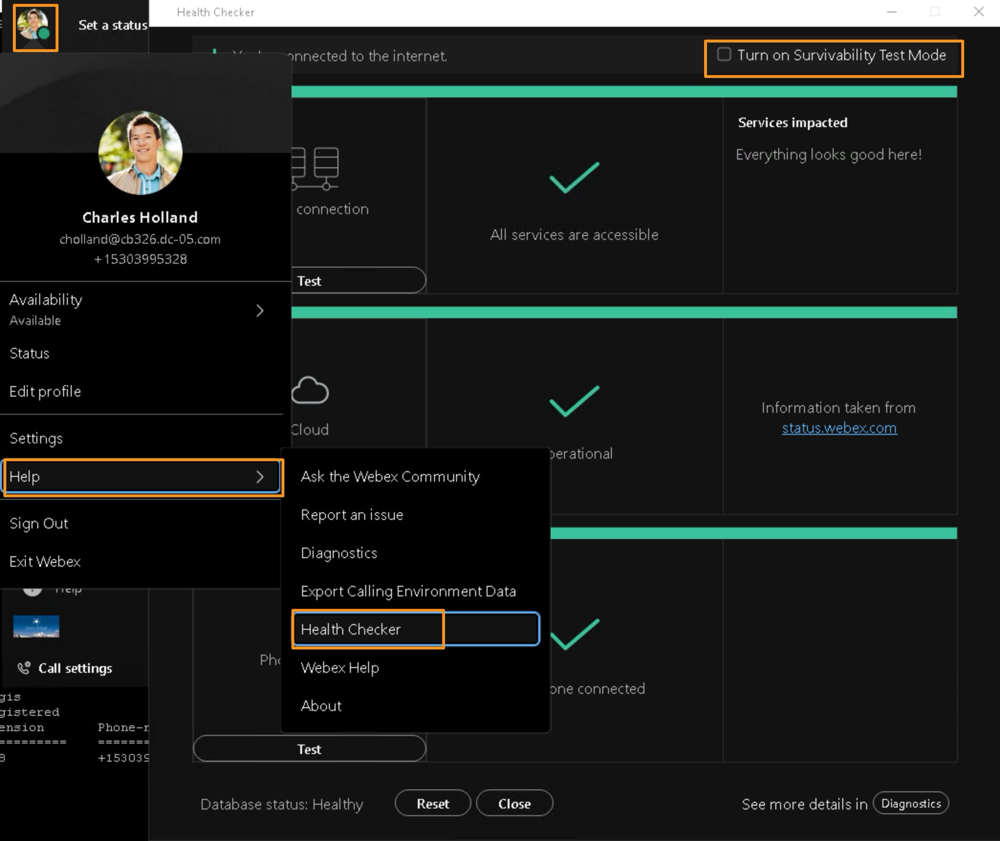

# Bonus Section – Calling between Webex Calling Multi-tenant and On-prem CUCM

## Bonus Section – Calling between Webex Calling Multi-tenant and On-prem CUCM

In this section, we are going to include calling to and from between Webex Calling and CUCM user(s). During the migration from On-prem to Webex Calling, often customer will have a Hybrid scenario with users on CUCM and on Webex Calling cloud. And during this Hybrid scenario, end-users still need to be able to call each other using their internal extensions e.g:4-digit or 5-digit dialing.

We will now provision this call scenario in our lab. Webex Calling will use the previously provisioned SIP Trunk to the Local Gateway and send the CUCM calls to the Local Gateway. We will create dial-peers in the Local Gateway to send these internal extension calls to CUCM.

We will setup the call routing in such a way that, the calling between Webex Calling and On-prem CUCM will work both with Local Gateway and Survivability Gateway (failover scenario).

First, we need to remove the user Charles Holland from the Survivability test mode in the Webex app.

* Go back to Workstation 1 and on the on Webex click on profile picture and go to <strong>Help</strong> &gt; <strong>Health Checker</strong>.

* On the <strong>Health Checker</strong> page, <strong>Un-</strong><strong>Check mark</strong> the option <strong>Turn on Survivability Test Mode</strong> on top right corner.

