# Configuring Local Gateway as Reg-based gateway

## Configuring the Local Gateway platform as a registration-based LGW for Webex Calling

* Continuing on Workstation 1, Open <strong>Putty</strong> from the taskbar.  Connect to <strong>198.18.133.226</strong> over SSH.


* Login with <strong>admin</strong>/<strong>dCloud123!</strong>

!!! note "Note"

    <strong>NOTE</strong>:  All the commands that are required to configure the Local Gateway are put in a text file called <em><strong>Wx</strong></em><em><strong>1</strong></em><em><strong>2025-GW-Config.txt</strong></em> on workstation 1 at <strong>Desktop</strong>.  If you are having trouble copying these commands from this document due to formatting issues, you can copy those commands from this file to <strong>Putty</strong>.  Right click on the file and click Edit with Notepad++.

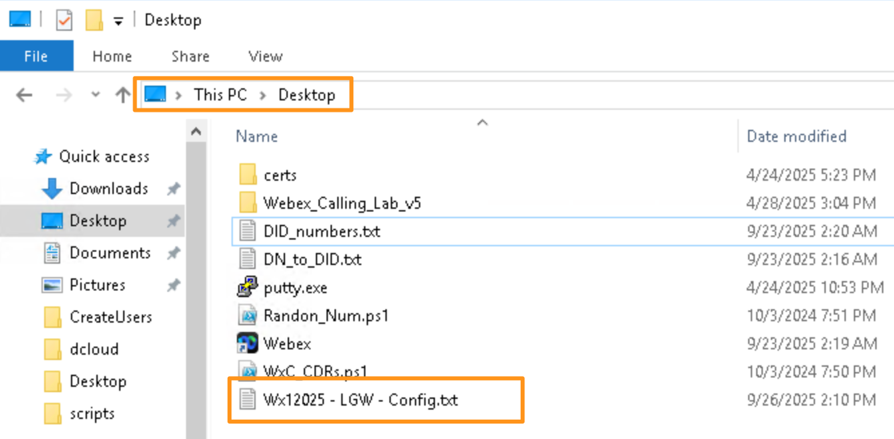

* Before we proceed with the Local Gateway configuration, we need to ensure that a master key must be pre-configured for the password.  Master Key can be configured with the commands shown below before it can be used in the credentials and/or shared secrets. Type 6 passwords are encrypted using AES cipher and a user-defined master key. We will use <strong>Password123</strong> as our master key.

<strong>Configuration:</strong>

```text
configure terminal
key config-key password-encrypt Password123
password encryption aes
end
```

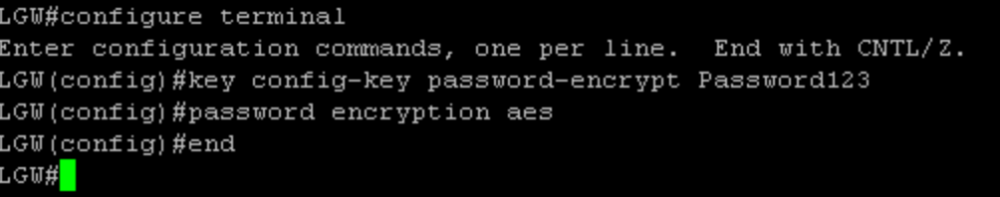

* Using the configuration below:

* Create a dummy PKI Trustpoint and call it dummyTp.

* Assign the trust point as the default signaling trustpoint under sip-ua. The cn-san-validate server is needed to ensure LGW establishes the connection only if the outbound proxy configured on tenant 200 (described later) matches with the CN-SAN list received from the server. The crypto trustpoint is needed for TLS to work even though a local client certificate (i.e. mTLS) is not required for the connection to be set up.

* Finally disable TLS v1.0 and v1.1 by enabling v1.2 exclusivity and set tcp-retry count to 1000 (5 seconds), as shown below.

<strong>Configuration:</strong>

```text
configure terminal
crypto pki trustpoint dummyTp
revocation-check crl
exit
sip-ua
crypto signaling default trustpoint dummyTp cn-san-validate server
transport tcp tls v1.2
tcp-retry 1000
end
```

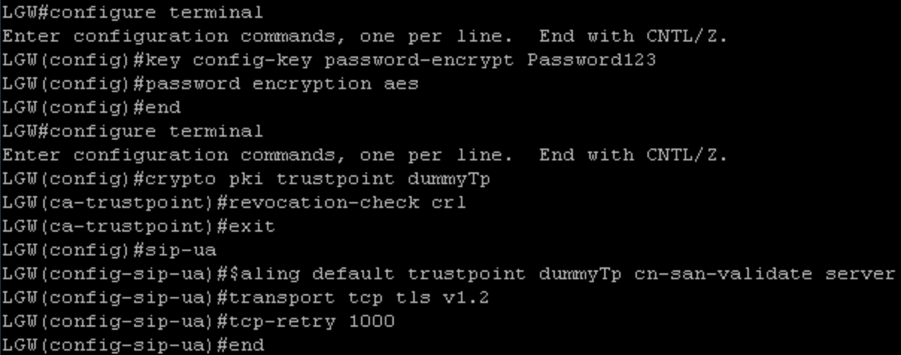

* The default trust pool bundle does not include the DigiCert Root CA certificate needed for validating the server-side certificate during TLS connection establishment to Webex. The trustpool bundle must be updated by downloading the latest Cisco Trusted Core Root Bundle from [http://www.cisco.com/security/pki](http://www.cisco.com/security/pki), as shown below.

<strong>Configuration:</strong>

```text
! Check if the DigiCert Root CA certificate exists
show crypto pki trustpool | include DigiCert
```

```text
! If not, update as shown below
configure terminal
crypto pki trustpool import clean url http://www.cisco.com/security/pki/trs/ios_core.p7b
end
```

```text
! Verify
show crypto pki trustpool | include DigiCert
```

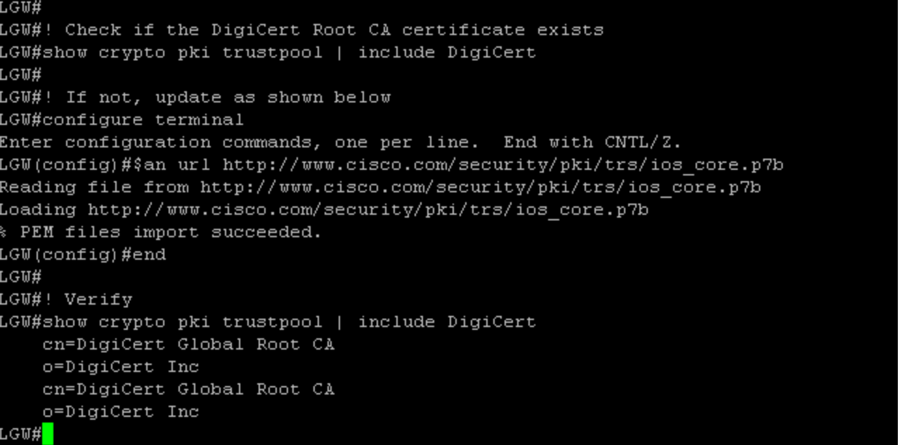

* Enter the following commands to turn on the Local Gateway/CUBE application on the platform.

<strong>Configuration:</strong>

```text
configure terminal
voice service voip
ip address trusted list
ipv4 23.89.0.0 255.255.0.0
ipv4 85.119.56.0 255.255.254.0
ipv4 85.119.57.128 255.255.255.192
ipv4 128.177.14.0 255.255.255.0
ipv4 128.177.36.0 255.255.255.0
ipv4 135.84.168.0 255.255.248.0
ipv4 135.84.169.0 255.255.255.128
ipv4 135.84.170.0 255.255.255.128
ipv4 135.84.171.0 255.255.255.128
ipv4 135.84.172.0 255.255.255.192
ipv4 135.84.173.0 255.255.255.128
ipv4 135.84.174.0 255.255.255.128
ipv4 139.177.64.0 255.255.248.0
ipv4 139.177.64.0 255.255.255.0
ipv4 139.177.65.0 255.255.255.0
ipv4 139.177.66.0 255.255.255.0
ipv4 139.177.67.0 255.255.255.0
ipv4 139.177.68.0 255.255.255.0
ipv4 139.177.69.0 255.255.255.0
ipv4 139.177.70.0 255.255.255.0
ipv4 139.177.71.0 255.255.255.0
ipv4 139.177.72.0 255.255.255.0
ipv4 139.177.73.0 255.255.255.0
ipv4 144.196.0.0 255.255.0.0
ipv4 150.253.128.0 255.255.128.0
ipv4 163.129.0.0 255.255.128.0
ipv4 170.72.0.0 255.255.0.0
ipv4 170.133.128.0 255.255.192.0
ipv4 185.115.196.0 255.255.252.0
ipv4 185.115.197.0 255.255.255.128
ipv4 199.19.196.0 255.255.254.0
ipv4 199.19.197.0 255.255.255.0
ipv4 199.19.199.0 255.255.255.0
ipv4 199.59.64.0 255.255.248.0
ipv4 199.59.65.0 255.255.255.128
ipv4 199.59.66.0 255.255.255.128
ipv4 199.59.67.0 255.255.255.128
ipv4 199.59.70.0 255.255.255.128
ipv4 199.59.71.0 255.255.255.128
exit
allow-connections sip to sip
media statistics
media bulk-stats
no supplementary-service sip refer
no supplementary-service sip handle-replaces
fax protocol t38 version 0 ls-redundancy 0 hs-redundancy 0 fallback none
stun
stun flowdata agent-id 1 boot-count 4
stun flowdata shared-secret 0 Password123$
sip
g729 annexb-all
early-offer forced
end
```

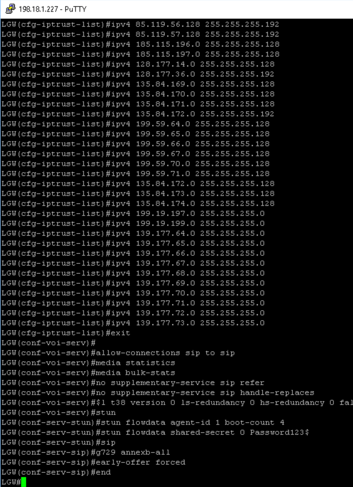

<strong>Explanation of Commands above.</strong>

<strong>ip address trusted list – Toll Fraud Prevention</strong>

This is to explicitly enable the source IP addresses of entities from which Local Gateway expects legitimate VoIP calls, for example, Webex peers, Unified CM nodes, IP PSTN. By default, LGW blocks all incoming VoIP call setups from IP addresses not in its trusted list. IP Addresses from dial-peers with session target ip or Server Group are trusted by default and need not be populated here.

IP addresses in this list need to match the IP subnets from the Port Reference section of the Configuration Guide for Cisco Webex Calling Customers document (  [https://help.webex.com/en-us/b2exve/Port-Reference-Information-for-Cisco-Webex-Calling\#id\_119637](https://help.webex.com/en-us/b2exve/Port-Reference-Information-for-Cisco-Webex-Calling) ). The configuration on the previous page includes all the existing Webex data centers as of the writing of this document but check the above link for the latest.

media statistics

Enables media monitoring on the LGW.

<strong>media bulk-stats</strong>

Enables the control plane to poll the data plane for bulk call statistics.

<strong>allow-connections sip to sip</strong>

Allows this platform to bridge two VoIP SIP call legs. It is disabled by default.

<strong>no supplementary-service sip refer and no supplementary-service sip handle-replaces</strong>

Disables REFER and replaces the Dialog ID in the Replaces header with the peer dialog ID.

<strong>fax protocol pass-through g711ulaw</strong>

Enables audio codec for fax transport.

<strong>stun</strong>

<strong>stun flowdata agent-id 1 boot-count 4</strong>

<strong>stun flowdata shared-secret 0 Password123$</strong>

Enables STUN globally. When a call is forwarded back to a Webex user (such as when both the called and calling parties are Webex subscribers and have the media anchored at the Webex SBC), the media cannot flow to the local gateway as the pin hole is not opened.

The STUN bindings feature on the local gateway allows locally generated STUN requests to be sent over the negotiated media path. The shared secret is arbitrary as STUN is only used to open the pinhole in the firewall and allow media latching to take place in the Webex Access SBC.

STUN password is a pre-requisite for LGW/CUBE to send STUN message out. IOS/IOS-XE-based firewalls can be configured to check for this password and open pin-holes dynamically (i.e. without explicit in-out rules). But for the LGW deployment case, the firewall is statically configured to open pin-holes in the outbound direction based on Webex SBC subnets, so the firewall should just treat this as any inbound UDP packet, which will trigger the pin-hole opening without explicitly looking at the packet contents.

<strong>sip</strong>

<strong>g729 annexb-all</strong>

Allows all variants of G729.

<strong>early-offer forced</strong>

This command forces the LGW/CUBE to send the SDP information in the initial INVITE message itself instead of waiting to send the information till it gets an acknowledgment from the neighboring peer.

* Configure the following SIP profile required to convert SIPS URI back to SIP as Webex does not support SIPS URI in the request/response messages (but needs them for SRV query, for example, \_sips.\_tcp.&lt;outbound-proxy&gt;). Rule 20 modifies the <strong>From</strong> header to include the Trunk Group OTG/DTG parameter from Control Hub to uniquely identify a LGW site within an enterprise. In the example below, <strong>dcloud-trunk7938\_lgu</strong> is used and you can see it in the trunk configuration and highlighted in the configuration. Make sure you replace the example OTG/DTG with your respective Trunk Group OTG/DTG information. Use Notepad to copy the commands below and to replace the OTG/DTG parameter with your own POD information.

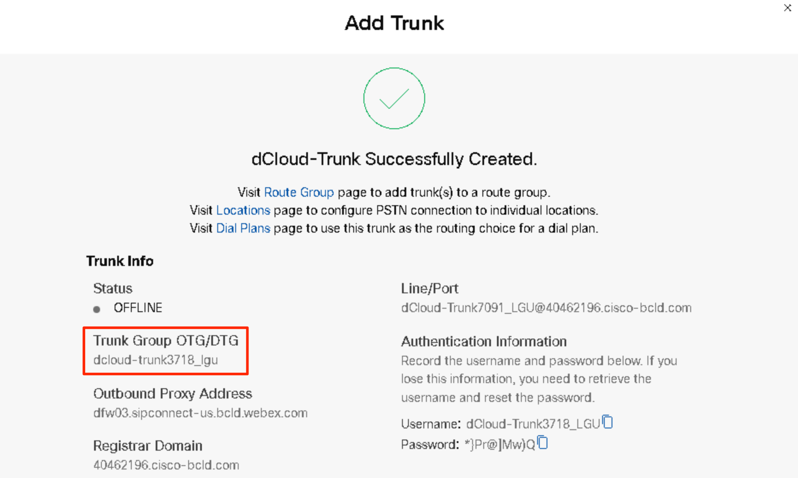

<strong>Configuration:</strong>

```text
configure terminal
voice class sip-profiles 200
rule 9 request ANY sip-header SIP-Req-URI modify "sips:(.*)" "sip:\1"
rule 10 request ANY sip-header To modify "<sips:(.*)" "<sip:\1"
rule 11 request ANY sip-header From modify "<sips:" "<sip:\1"
rule 12 request ANY sip-header Contact modify "<sips:(.*)>" "<sip:\1;transport=tls>"
rule 13 response ANY sip-header To modify "<sips:(.*)" "<sip:\1"
rule 14 response ANY sip-header From modify "<sips:(.*)" "<sip:\1"
rule 15 response ANY sip-header Contact modify "<sips:(.*)" "<sip:\1"
rule 20 request ANY sip-header From modify ">" ";otg=dcloud-trunk3718_lgu>"
rule 30 request ANY sip-header P-Asserted-Identity modify "sips:(.*)" "sip:\1"
end

```

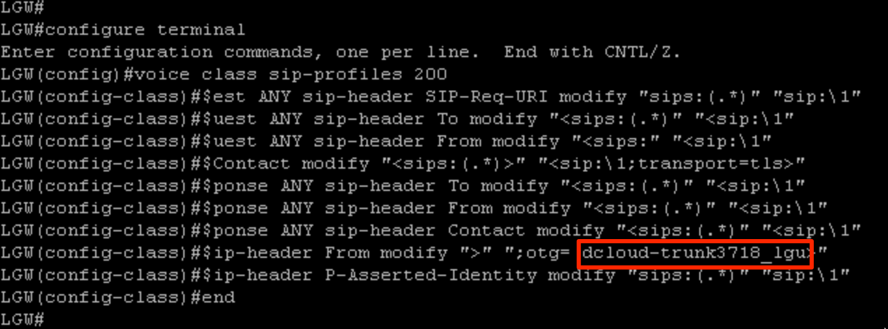

* Configure Codec Profile, STUN definition, and SRTP Crypto suite as shown and explained below.

<strong>Configuration:</strong>

```text
configure terminal
voice class codec 99
codec preference 1 g711ulaw
codec preference 2 g711alaw
exit

voice class srtp-crypto 200
crypto 1 AES_CM_128_HMAC_SHA1_80
exit

voice class stun-usage 200
stun usage firewall-traversal flowdata
exit
```

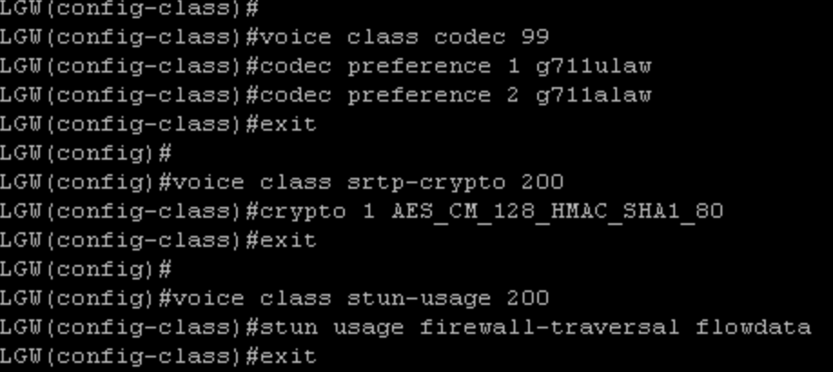

<em><strong>Explanation of commands above</strong></em>:

<strong>voice class codec 99</strong>

Allows both g711(mu and a-law) codecs for sessions. Will be applied to all the dial-peers.

<strong>voice class srtp-crypto 200</strong>

Specifies SHA1\_80 as the only SRTP cipher-suite that will be offered by LGW/CUBE in the SDP in offer and answer. Webex only supports SHA1\_80. This command will be applied to voice class tenant 200 (discussed later) facing Webex.

<strong>voice class stun-usage 200</strong>

Defines STUN usage. Will be applied to all Webex facing (2XX tag) dial-peers to avoid no-way audio when a Unified CM Phone forwards the call to another Webex phone.

* Configure voice class tenant 200 as shown below. This is the MOST IMPORTANT step to configure the Local Gateway, you will need all the configuration you copied in the “LGW-Trunk-Configuration” notepad file to create the Voice Class Tenant 200 that allows the Local Gateway to register to Webex Calling. Be sure to replace the values from the below configuration example with the parameters obtained from the Control Hub for your own POD and which are explained in detail below. DO NOT COPY THE NEXT COMMANDS IN THE LOCAL GATEWAY CLI UNTIL YOU HAVE REPLACED ALL THE PARAMETERS WITH THE CORRECT ONES FROM YOUR CONTROL HUB.  Use the color code guidance from the picture below with the configuration example to replace the values.  If you are copying the commands from .txt file located on Desktop.  All the values you need to replace are labeled starting with “v\_”.

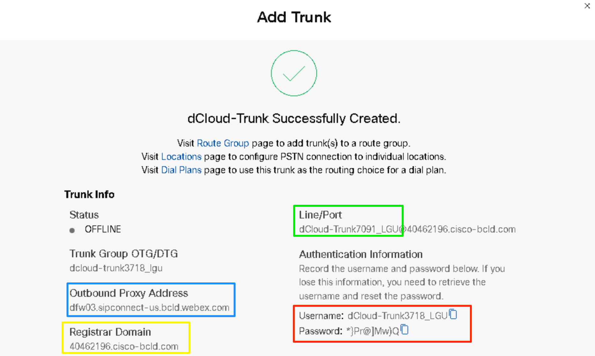

<strong><br></strong>

<strong>Configuration</strong><strong>:</strong>

```text
configure terminal
voice class tenant 200
registrar dns:40462196.cisco-bcld.com scheme sips expires 240 refresh-ratio 50 tcp tls
credentials number dCloud-Trunk7091_LGU username dCloud-Trunk3718_LGU password 0 *}Pr@]Mw)Q realm BroadWorks
authentication username dCloud-Trunk3718_LGU password 0 *}Pr@]Mw)Q realm BroadWorks
authentication username dCloud-Trunk3718_LGU password 0 *}Pr@]Mw)Q realm 40462196.cisco-bcld.com
no remote-party-id
sip-server dns:40462196.cisco-bcld.com
connection-reuse
srtp-crypto 200
session transport tcp tls
url sips
error-passthru
asserted-id pai
bind control source-interface GigabitEthernet1
bind media source-interface GigabitEthernet1
no pass-thru content custom-sdp
sip-profiles 200
outbound-proxy dns:dfw03.sipconnect-us.bcld.webex.com
privacy-policy passthru
end

```

- What is in yellow needs to be replaced by the <strong>Registrar Domain</strong> parameter.

- What is in green needs to be replaced by the <strong>Line/Port</strong> parameter, <strong>copy the parameter info before the @.</strong>

- What is in red needs to be replaced by <strong>username</strong> and <strong>password</strong> parameter.

- What is in blue needs to be replaced by the <strong>Outbound Proxy Address</strong> parameter

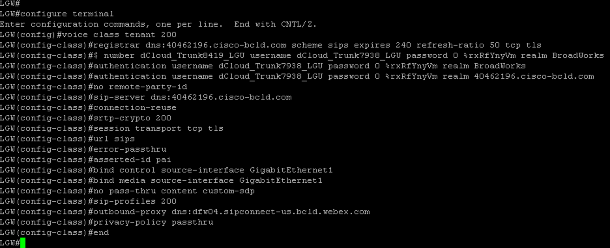

<em><strong>Explanation of Commands</strong></em>:

<strong>voice class tenant 200</strong>

This CUBE multi-tenant feature enables specific global configurations for multiple tenants on SIP trunks that allow differentiated services for tenants.

<strong>registrar dns:40462196.cisco-bcld.com scheme sips expires 240 refresh-ratio 50 tcp tls</strong>

Registrar server for the Local Gateway with the registration set to refresh every two minutes (50% of 240 seconds).

<strong>credentials number dCloud-Trunk7091\_LGU username dCloud-Trunk3718\_LGU password 0 \*\}Pr@\]Mw)Q realm BroadWorks</strong>

Credentials for Trunk Registration challenge.

<strong>authentication username dCloud-Trunk3718\_LGU password 0 \*\}Pr@\]Mw)Q realm BroadWorks</strong>

Authentication challenge for calls.

<strong>authentication username dCloud-Trunk3718\_LGU password 0 \*\}Pr@\]Mw)Q realm 40462196.cisco-bcld.com</strong>

Authentication challenge for calls.

<strong>no remote-party-id</strong>

Disable SIP Remote-Party-ID (RPID) header as Webex supports PAI, which is enabled using CLI asserted-id pai (see below).

<strong>sip-server dns:40462196.cisco-bcld.com</strong>

Webex servers

<strong>connection-reuse</strong>

To use the same persistent connection for registration and call processing.

<strong>srtp-crypto 200</strong>

Specifying SHA1\_80 defined in voice class srtp-crypto 200.

<strong>session transport tcp tls</strong>

Setting transport to TLS

<strong>url sips</strong>

SRV query has to be SIPS as supported by the access SBC; all other messages will be changed to SIP by sip-profile 200.

<strong>error-passthru</strong>

SIP error response pass-thru functionality

<strong>asserted-id pai</strong>

Turn on PAI processing in LGW/CUBE

<strong>bind control source-interface GigabitEthernet1</strong>

Signaling source interface facing Webex

<strong>bind media source-interface GigabitEthernet1</strong>

Media source interface facing Webex

<strong>no pass-thru content custom-sdp</strong>

Default command under tenant

<strong>sip-profiles 200</strong>

To change SIPS to SIP and modify Line/Port for INVITE and REGISTER messages as defined in: voice class sip-profiles 200

<strong>outbound-proxy dns:dfw03.sipconnect-us.bcld.webex.com</strong>

Webex Access SBC

<strong>privacy-policy passthru</strong>

Transparently pass across privacy header values from incoming to the outgoing leg.

* Next, configure the following voice class tenants.

<em><strong>Configuration</strong></em><strong>:</strong>

```text
configure terminal
! Voice Class Tenant 100 will be applied to OUTBOUND dial-peers facing the IP PSTN
voice class tenant 100
session transport udp
url sip
error-passthru
bind control source-interface GigabitEthernet2
bind media source-interface GigabitEthernet2
no pass-thru content custom-sdp

! Voice class tenant 300 will be applied to INBOUND dial-peers from the IP PSTN
voice class tenant 300
bind control source-interface GigabitEthernet2
bind media source-interface GigabitEthernet2
no pass-thru content custom-sdp
end

```

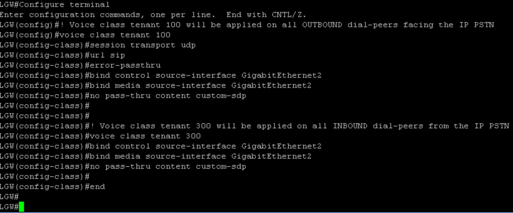

* At this point, after you have configured the Voice Class Tenant, the <strong>Local Gateway</strong> should be registered, you will see the registration status <strong>yes</strong> after a few minutes (2 or 3 minutes).
