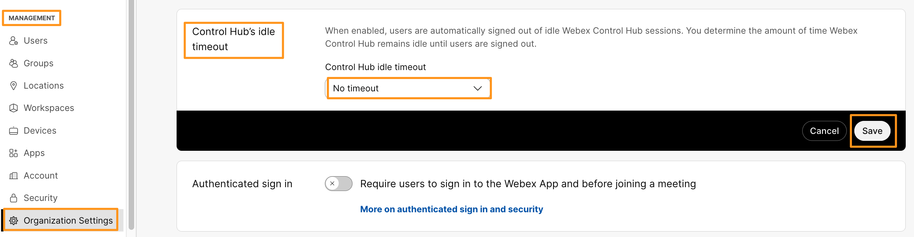
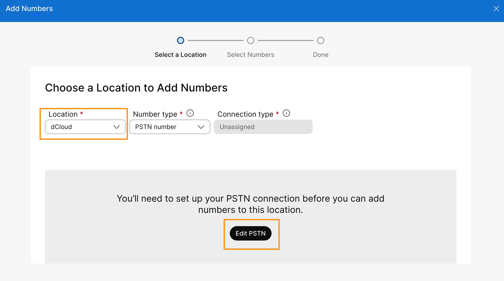
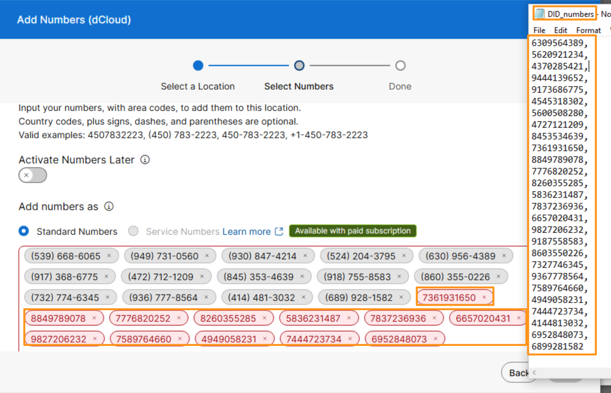
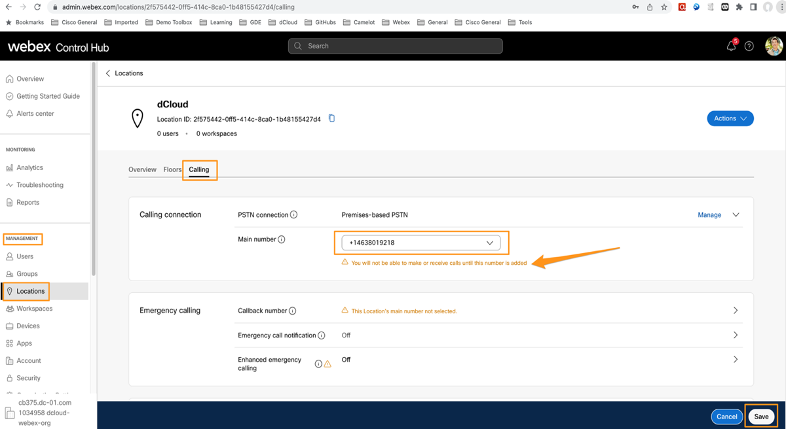
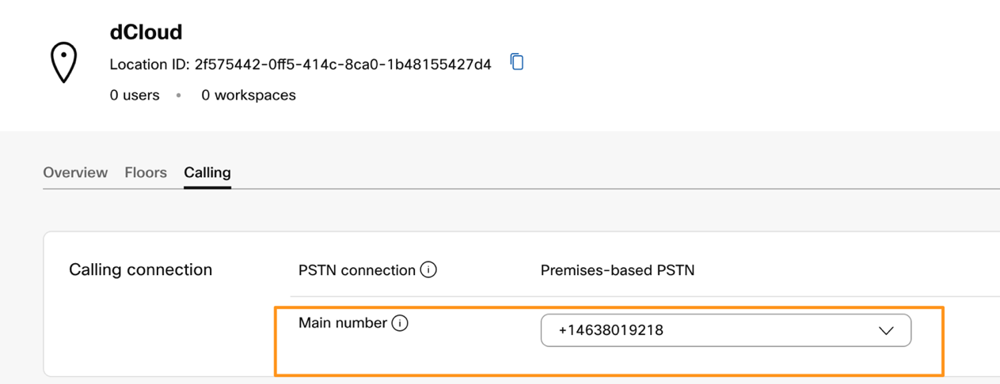

# Configuring Webex Calling Location

## Configuring Webex Calling Location

By default, Webex Calling will not let to make inbound and outbound calls until you complete location configuration and assign a main number for that location.  In this lab, the location has been configured with address and other parameters.  However, we will import some numbers and assign one of them as the main number to the location.

* Open RDP connection to Workstation 1 at 198.18.1.36 using Option A or Option B as described in <strong>Get Started</strong> section above. Once connected to Workstation 1, Open Chrome browser from task bar &amp; go to Collaboration Admin Links &gt; Cisco Webex Control Hub. Log in to <strong>Webex Control Hub</strong> as [cholland@cbXXX.dc-YY.com](mailto:cholland@cbXXX.dc-YY.com) &amp; <strong>dCloudZZZZ!</strong>

* You can find the Control Hub Username and Password from the "Session_info.txt" that you have already opened. Use the credentials from there and login to the Control Hub.

* Before we start working on lab, let's update Webex Control Hub idle timeout.  By default, Webex Control Hub logs out <strong>every 20 minutes</strong>.  Let's update that timeout so you would not need to login to Webex Control Hub multiple time.  On Webex the Control Hub, on left side pane go to <strong>MANAGEMENT</strong> &gt; <strong>Organization Settings</strong>.  On the Organization Settings page scroll down a little and drop down the option for <strong>Control Hub’s idle timeout</strong> to <strong>No timeout</strong> and click <strong>Save</strong>.

* Now, go to <strong>SERVICES</strong> &gt; <strong>PSTN &amp; Routing</strong>. Click + <strong>Add Numbers</strong> under Numbers tab.

* On the <strong>Add Numbers</strong> page, drop down the option for Location and choose <strong>dCloud. </strong>Since we are setting up this location for the first time, first we need to select the PSTN Connection for this location.  Click <strong>Edit</strong> <strong>PSTN</strong>.

* You will be taken to <strong>Edit PSTN connection for dCloud</strong> (Location) and under the connection type choose <strong>Premises-based PSTN</strong> (formerly local gateway) and click <strong>Next</strong>.

* On the following page, drop down the option for Routing Choice and choose <strong>None.  </strong>Even though <strong>None</strong> option is being shown as selected, you still must click the dropdown option and choose <strong>None</strong> again. Select the checkbox for the confirmation and click <strong>Next</strong>.

* On the following page click <strong>Add Numbers Now </strong>(bottom right corner).  You will be taken back to <strong>Add Numbers</strong> page with the <strong>PSTN connection</strong> populated, click <strong>Next</strong>.

* Minimize the browser (and other applications), and on the desktop find the TEXT file named <strong>DID\_Numbers.txt.</strong> It will have some Dummy DID Numbers prepopulated for you. Select all of them, copy and paste them into <strong>Enter phone numbers</strong> field on Control Hub as shown below. Some Numbers might be marked in Red; this is because that number is either already used or taken by someone else within Webex Calling. You can remove all those numbers marked in Red by clicking the cross button next to them. Click <strong>Save</strong>.

!!! note "Note"

    You will not face this issue of numbers being taken in production as you own the numbers from your Telco provider for your organization.

    Webex will format them automatically and if needed adds respective local area code etc.,

* Click <strong>Close</strong> on the following page and you will be taken to the Numbers page where you can see all the numbers you have just added.

* Now, let’s assign one of these numbers to the <strong>dCloud</strong> Location.  On the Control Hub, go to <strong>MANAGEMENT</strong> &gt; <strong>Locations</strong>.

* Select the <strong>dCloud</strong> location.  Go to the <strong>PSTN</strong> tab, you will notice that under the <strong>Main Number </strong>field, there is a warning that reads <strong>You will not be able to make or receive calls until this number is added.</strong>

* Drop down the option for <strong>Main Number</strong> and choose any of the numbers you imported above and click <strong>Save</strong>.

* As soon as you save, the warning will disappear, indicating now your location can make and receive calls.

