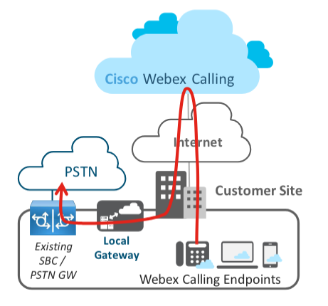

# Chapter 2 Local Gateway Configuration and verification of call routing

## Chapter 2 Webex Local Gateway Registration

### Deploying a Local Gateway for PSTN Calling

With this feature, you can Bring Your Own PSTN (BYoPSTN) and provide PSTN connectivity to your cloud registered endpoints.

There are two models to configure the Local Gateway for your Webex Calling trunk:

- Registration-based trunk

- Certificate-based trunk

See [Get started with Local Gateway ](https://help.webex.com/en-us/article/t9xctu)for more information on different trunk types. We use Session Initiation Protocol (SIP) and Transport Layer Security (TLS) transport to secure the trunk and Secure Real Time Protocol (SRTP) to secure the media between the Local Gateway and Webex Calling.

For this lab, we are going to use the Registration based trunk.

<strong>Registration-based Local Gateway:</strong>

This is simpler option of the two and requires one-way connection from Local Gateway to the Webex Calling.  In this model, Local Gateway maintains active SIP registration to the cloud. This model supports up to 250 concurrent calls per voice class tenant.

Local Gateway routes calls between Webex Calling &amp; PSTN Gateway.  The PSTN Gateway can be either dedicated CUBE or it can co-resident with Local Gateway CUBE.  In this lab the PSTN Gateway is a separate dedicated CUBE – which is already pre-programmed and we do not have to access/add or configure it. We will only register the Local Gateway as a Registration-based gateway to Webex Calling.

!!! note "Note"

    The Local Gateway configuration provided in this lab is for <strong>C8000v</strong> running IOS-XE version 17.16.01a.

### Onboarding a Premises-based trunk for registration based

Enabling a Local Gateway for Webex Calling requires:

- Adding a Trunk in Webex Control Hub as a registration-based

- Configure the Local Gateway platform to establish connectivity with Webex Calling

- Configure Call Routing on LGW
