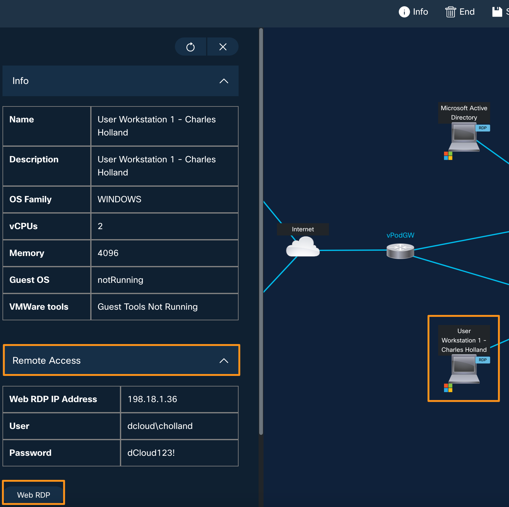
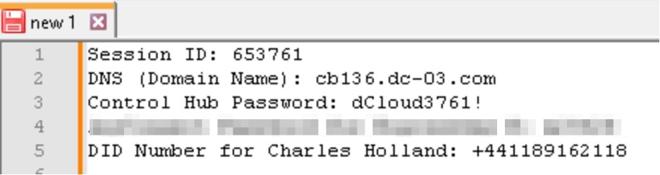

# Getting started / accessing the lab

## Getting started / Accessing the Lab

1. Open a browser on your laptop and go to [https://dcloud.cisco.com](https://dcloud.cisco.com)

2. Click Login at the top right corner and log in with your Cisco.com credentials.

3. Once logged in, open a new browser tab and paste the event URL for your lab.  The event URL is https://dcloud2-sjc.cisco.com/event/397776/access

4. You will be automatically assigned to a lab pod, and you will be taken to the Lab topology page as shown below.

5. Click on the <strong>User Workstation 1</strong> icon on the topology page and it will bring up a fly-out window on left with <strong>Workstation 1</strong> related information like <strong>IP Address</strong>, <strong>username</strong>, and <strong>password</strong> as shown below.

6. Similarly, you can click on any other Virtual Machine on the topology page to get its respective details.

7. In this lab, you will access <strong>Workstation 1</strong> (through <strong>WebRDP</strong> or <strong>Remote Desktop</strong>) and from <strong>Workstation 1</strong> you will be able to access all the CUBE/Local Gateway to complete the lab tasks.

8. There are two ways you can access <strong>Workstation 1</strong>. You can either connect via a <strong>local RDP</strong> connection (option A - preferred) connection or via a <strong>WebRDP</strong> connection (option B) from your classroom laptop.

<strong>Option (A)</strong> <strong>– \[Preferred\]</strong>

To connect to the Workstation using your <strong>local RDP connection</strong>, first, you need to connect to your lab session via <strong>VPN</strong>. Open <strong>Cisco AnyConnect</strong> client on your laptop. It will prompt you for the <strong>Host Address</strong>, <strong>username,</strong> and <strong>password</strong> information for your session.  You will find all these details under the <strong>Info</strong> &gt; <strong>AnyConnect</strong> <strong>Credentials</strong> section of your lab.  Enter all the details as shown below and click <strong>OK</strong> to connect to your session.  The <strong>Host Address</strong>, <strong>username,</strong> and <strong>password </strong>will be different for each lab.  Use <strong>YOUR OWN</strong> assigned lab details.

Once you are connected to your lab session over VPN, you can open a local RDP connection on your laptop and connect to <strong>Workstation 1</strong> using the following details:

Host: <strong>198.18.1.36</strong>

Username: <strong>dcloud\\cholland</strong>

Password: <strong>dCloud123!</strong>

<strong>Option (B) </strong>

To access Workstation 1 over <strong>WebRDP</strong>, click on the <strong>Workstation 1</strong> icon on the topology page and when it brings up a fly-out window with workstation details.  On the fly-out window go to click on the <strong>Remote Access &gt; Web RDP</strong>.  It will open a new browser tab and connect you to Workstation 1.

9. Once you are connected to Workstation 1, go to your dCloud lab topology page, click on the <strong>Info</strong> tab, and a fly-out window will open on the left side. Here you will find all your lab-related information like the <strong>Session ID</strong>, <strong>VPN</strong> connection details, <strong>DNS Domain</strong> name and <strong>PSTN Numbers,</strong> etc., You will need all this information throughout this lab.

10. It would be a good idea to create a <strong>notepad</strong> (or <strong>notepad++</strong>) on <strong>Workstation 1</strong> desktop and note down your session-related information like the <strong>Session ID, Domain name (DNS), Control Hub password</strong>, etc. This information will be required throughout the lab modules.

<strong>Session ID</strong>: you will find it under the details tab, as shown above (Example 116<strong>8643</strong>)

<strong>Control Hub password</strong>: dCloud<strong>8643</strong>! (dCloud + last four digits of session ID + !)

<strong>Domain Name</strong>: Go to the details tab of your session and scroll down to see the DNS name. It will be in the cb<strong>XXX</strong>.dc-<strong>YY</strong>.com format.

<strong>DID Numbers</strong> for user <strong>Charles Holland</strong> for inbound PSTN calls for testing: Scroll down under Session Details and note down the <strong>External (DID) number</strong> associated with <strong>Internal (DN) 6018</strong>.

<strong>Now you can proceed with the lab modules.</strong>
