# Install Gateway Connector

## Install the gateway connector on CUBE/Gateway

Before you can add a gateway to Control Hub as a Managed gateway, you will need to install a <strong>connector application</strong> on your device.

* Continuing on Workstation 1, minimize all applications on desktop.  Open new Putty window and connect to Survivability Gateway at 198.18.133.226 over SSH.

* Login with credentials admin/dCloud123!

* Run the following command to start <strong>connector application</strong> installation.

!!! note "Note"

    All the commands are that are required to configure Local Gateway are put in a text file called <em><strong>Wx</strong></em><em><strong>1</strong></em><em><strong>2026</strong></em><em><strong> – L</strong></em><em><strong>GW</strong></em> <em><strong>-</strong></em> <em><strong>Config.txt</strong></em> on workstation 1 <strong>Desktop</strong> folder.  If you are having trouble copying these commands from this document due to formatting issues, you can copy those commands from this file to <strong>Putty</strong>.  Right click on the file and click Edit with Notepad++.


<strong>Configuration:</strong>

```text
tclsh https://binaries.webex.com/ManagedGatewayScriptProdStable/gateway_onboarding.tcl
```

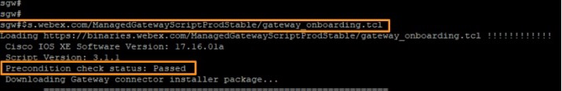

This command runs precondition check to validate requirements for CUBE like disk space etc., if successful then it prints <strong>Precondition check status: Passed</strong>.  Then it downloads and runs connector installation script.

* At the prompt to select external interface enter number <strong>2</strong> and press <strong>Enter</strong>.

* Next, it will prompt you to enter DNS Server address, enter <strong>198.18.133.1</strong> and press <strong>Enter</strong>

* Select <strong>N </strong>for Proxy required option &amp; press <strong>Enter</strong>.

* For the <strong>Connector IP address</strong> enter <strong>198.18.133.200 </strong>&amp; press <strong>Enter</strong>

!!! note "Note"

    The Connector IP address must be in the same network as the interface chosen for external connectivity. It can be a private network address, but it must have HTTP access to the internet.

- 198.18.133.226 – GigabitEthernet2 used to access the network

- 198.18.133.200 - Connector IP, used by Managed GW connector

* Enter <strong>Gateway username</strong> as <strong>admin</strong> and press <strong>Enter</strong>.

* Enter <strong>dCloud123!</strong> For <strong>Gateway Password</strong> and <strong>Confirm Password</strong>.

!!! note "Note"

    <strong>NOTE</strong>: These credentials are used by the connector to access the platform’s NETCONF interface. This is an example of the basic configuration which was configured on this IOS-XE platform for this to work.  These commands are listed for information purpose only. <strong>They are already configured on the </strong><strong>IOS-XE platform.</strong>

    ```text
    aaa new-model
    aaa authentication login default local 
    aaa authorization console
    aaa authorization exec default local
    username admin privilege 15 secret dCloud123!   
    ```


    The username and secret must match with what is being configured during this step.

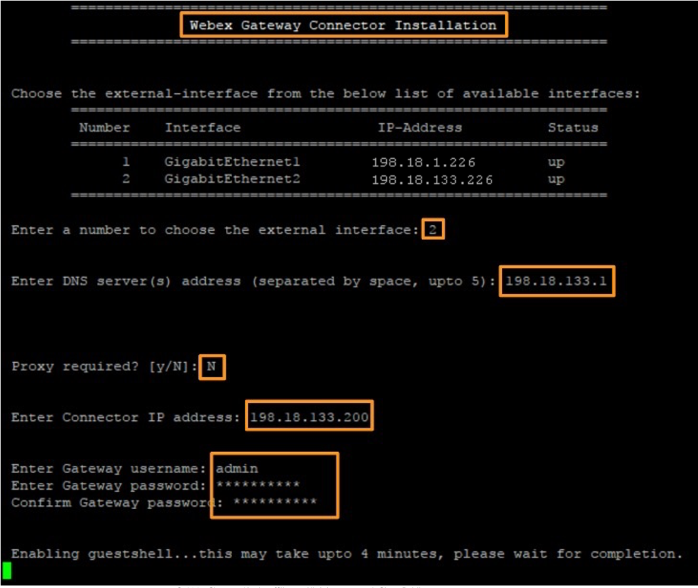

* It takes around 4 to 5 minutes for connector application installation and configuration with above values.  Wait for the installation process to complete.

* Once the installation &amp; configuration process is completed It will show the interfaces and the application status as shown below.  Once you verify all the interfaces are showing <strong>up</strong> as the status and the service status is <strong>RUNNING,</strong> enter <strong>q</strong> to quit configuration menu.

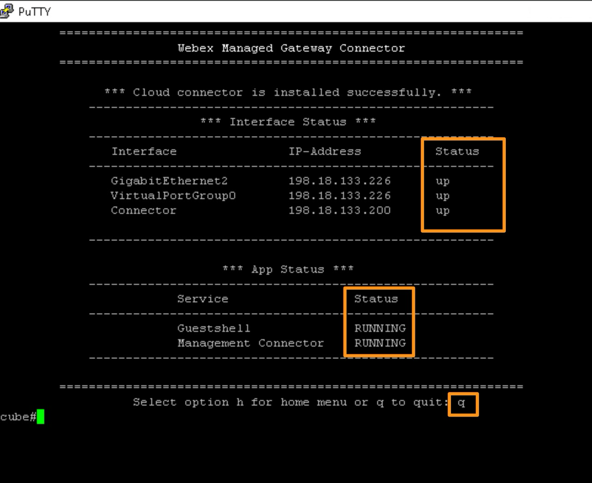

* This completes installation of connector application on the gateway, now we can continue to add it to the Webex Control Hub.

## Enroll the IOS-XE gateway in the Webex Control Hub

* Continuing on Workstation 1, minimize Putty and other applications.  Go back browser tab where you have logged into Webex Control Hub.  If the previous login timed out login as [cholland@cbXXX.dc-YY.com](mailto:cholland@cbXXX.dc-YY.com).

* On the Control hub page go to <strong>SERVICES</strong> &gt; <strong>PSTN &amp; Routing</strong>.  On the <strong>PSTN &amp; Routing</strong> page go to <strong>Gateway Configurations &gt;</strong> <strong>Managed gateway</strong><strong>s</strong> tab.  Click <strong>Add gateway</strong>.

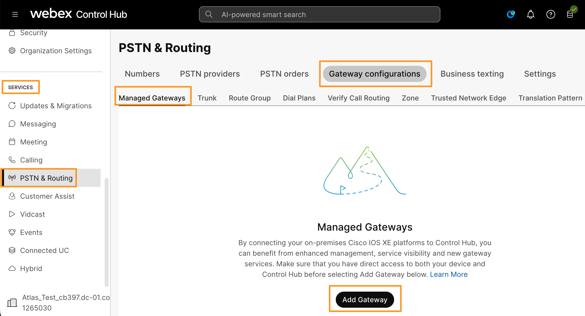

* It will bring up <strong>Add a managed gateway</strong> wizard.  <strong>Check mark</strong> option to confirm that <strong>I have installed the management connector on the gateway</strong> and click Next.

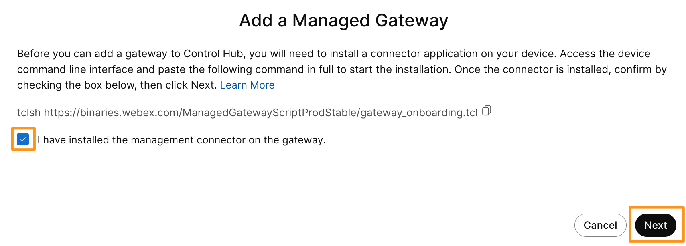

* On the following page enter the following information and click Next.

- Connector IP address: 198.18.133.200

- Display name: sgw

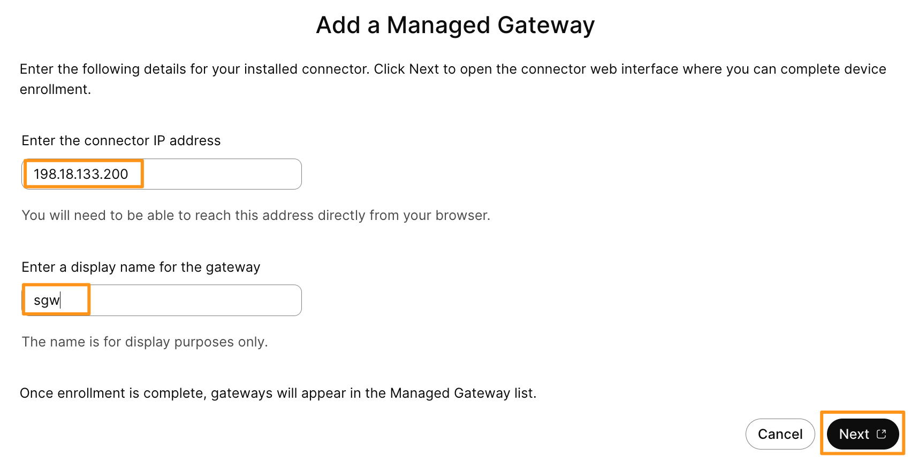

* It will open a new browser tab to the connector IP address (Survivability Gateway).  Click <strong>Advanced</strong> and <strong>Proceed to 198.18.133.200</strong> on the new tab.  It will take you to login page, login as <strong>admin</strong> and <strong>dCloud123!</strong> (same credentials we configured that we configured during connection application installation)

* Once logged in click <strong>Enroll Now</strong> on the <strong>Gateway Connector Management</strong> page.

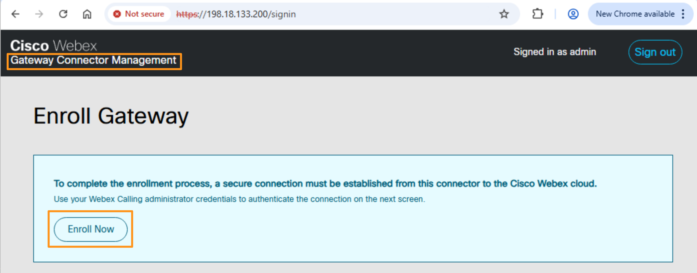

* If it will take you to Webex Control Hub login page.  Login as [cholland@cbXXX.dc-YY.com](mailto:cholland@cbXXX.dc-YY.com)

* Once Control Hub credentials are entered, on the Allow Access to Gateway Management Connector page, <strong>check mark</strong> option to <strong>Allow Access to Gateway Management Connector</strong> and click <strong>Continue</strong>.

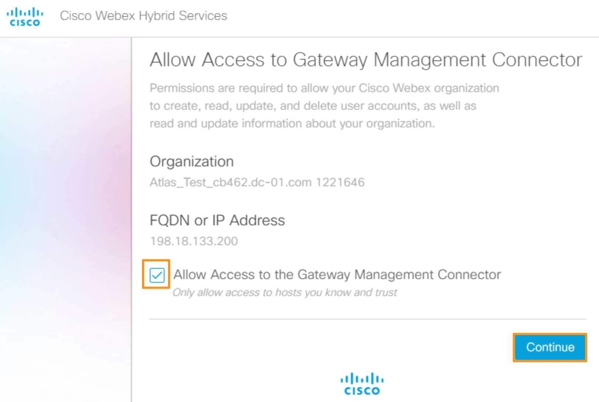

* The enrollment of the gateway to Webex Control Hub should be successful.  You can close this browser tab now.

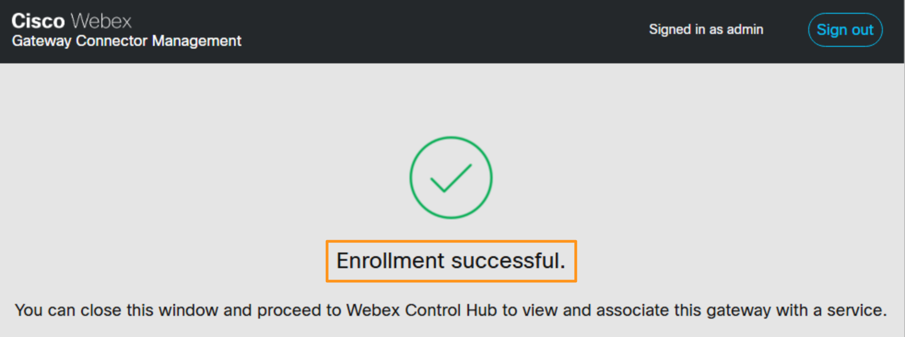

* Now open a new browser tab and go to [https://198.18.133.200](https://198.18.133.200) (The Connector IP address) and login as admin and dCloud123! (if prompted).  It will install two services <strong>Management Connector</strong> and <strong>Telemetry Connector</strong>; the status of the services would change from installing to Connected once the installation is complete. This process takes a few minutes.

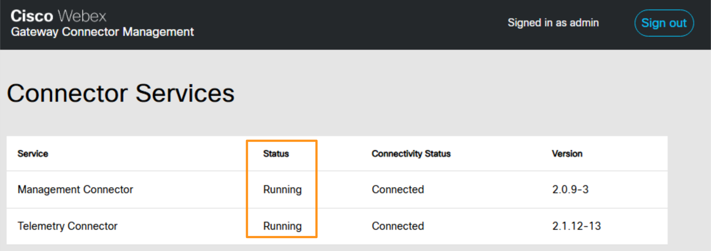

* Go back to browser tab where the Webex Control Hub is logged in.  Go to <strong>SERVICES</strong> <strong>&gt;</strong> <strong>Calling</strong> <strong>&gt;</strong> <strong>PSTN &amp; Routing &gt; Gateway Configurations &gt;</strong> <strong>Managed gateways</strong> (if you are already on that page, click page refresh/reload).  Verify that <strong>Connection Status</strong> for the gateway shows <strong>Online</strong>.

* Click three dots, towards right side and select <strong>Assign Service.</strong>

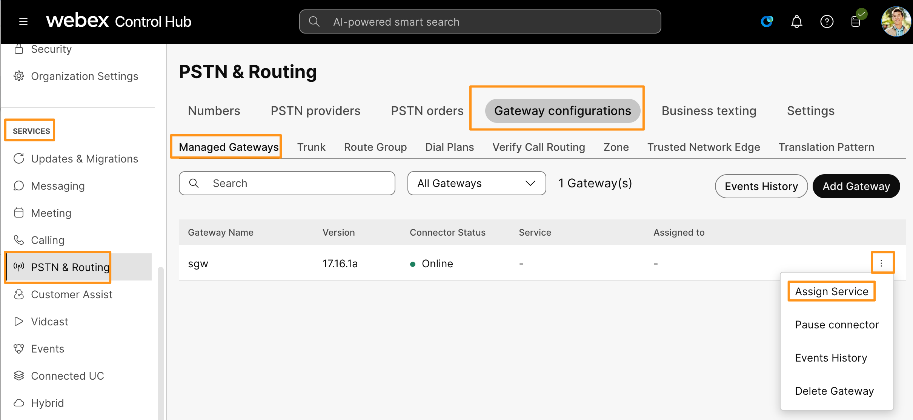

* It will bring up <strong>Assign Service to sgw</strong> wizard.  Configure the following parameters and click <strong>Assign</strong>.

- Drop down option for <strong>Webex Calling Service</strong> and select <strong>Survivability gateway</strong>

- Drop down option for <strong>Location</strong> and select <strong>dCloud</strong>

- Enter the Host Name as <strong>cube</strong><strong>.cbXXX.dc-YY.com  </strong>(replace cbXXX.dc-YY.com - this is the same domain from Charles Holland email domain portion)

- Enter the IP Address as <strong>198.18.133.</strong><strong>22</strong><strong>6</strong> (GigabitEthernet2)

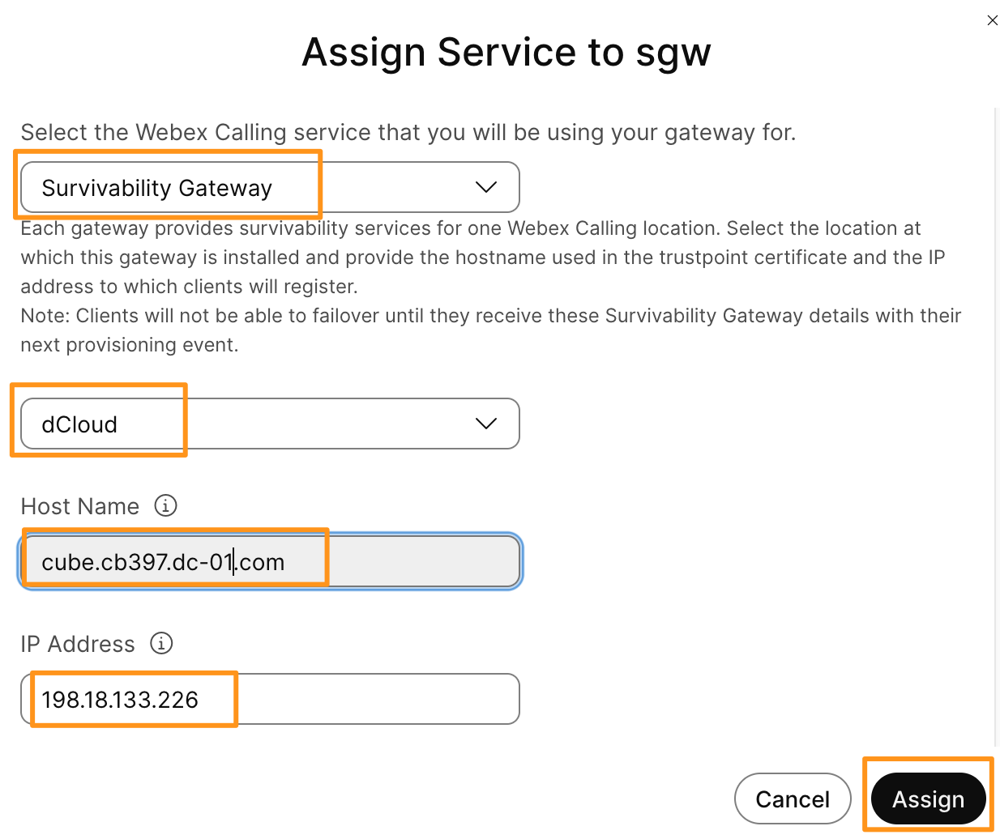

* The Gateway will be assigned with Service (<strong>Survivability Gateway</strong>) &amp; location (<strong>dCloud</strong>) as shown below.

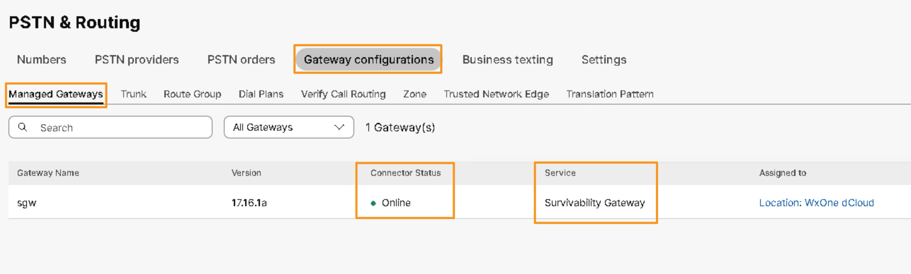

* Click on the gateway <strong>sgw</strong> and on the gateway page click <strong>Download config template</strong> to download the configuration template that can be used to configure the Survivability Gateway.

!!! note "Note"

    You can review the downloaded configuration template however in this lab the configuration steps/commands are already provided on Workstation 1 for easy access and use.

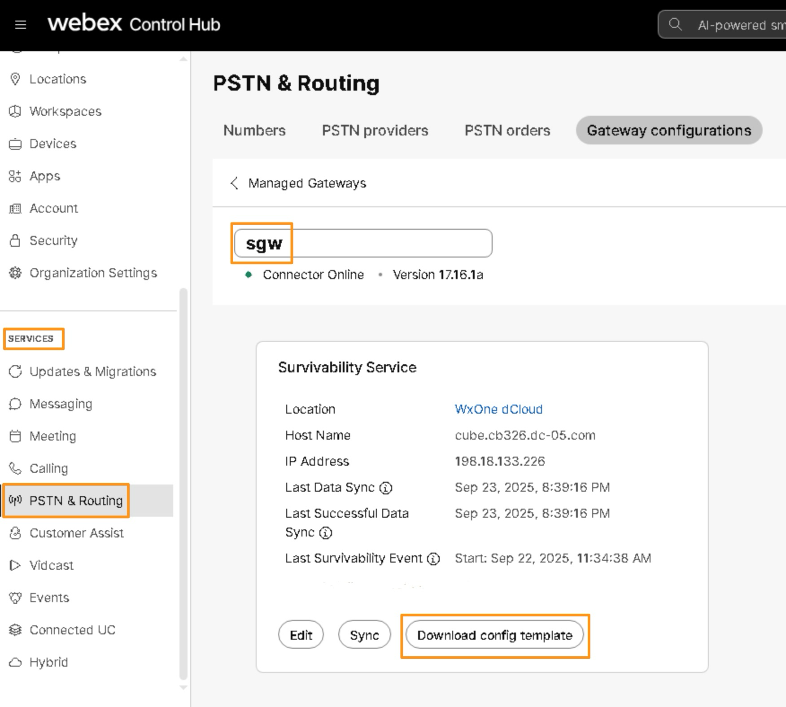
