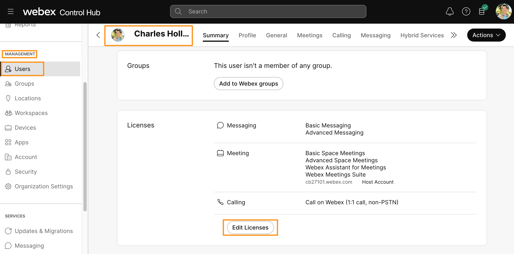
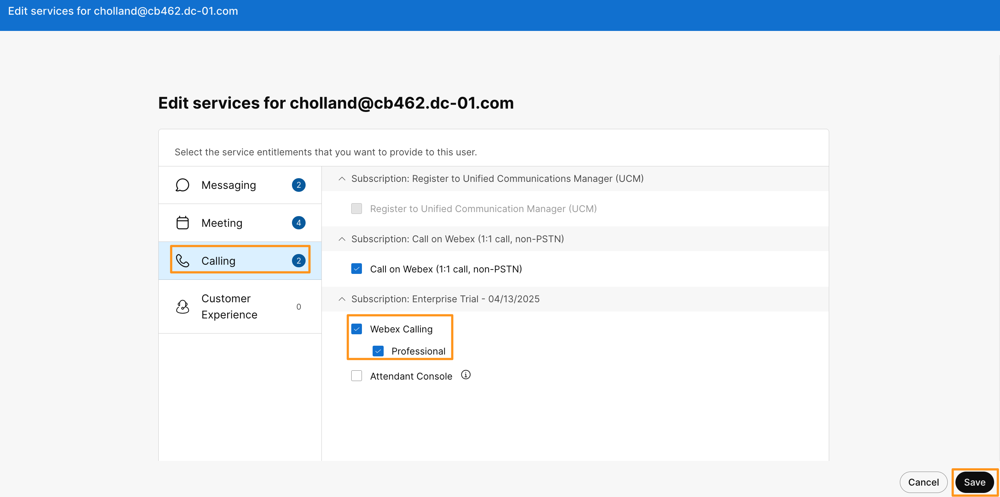
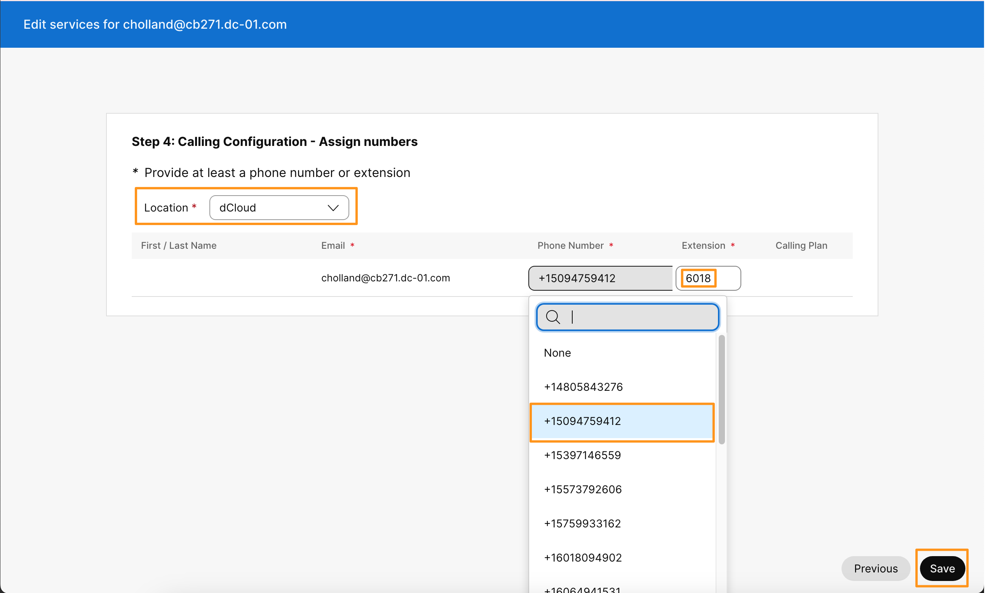
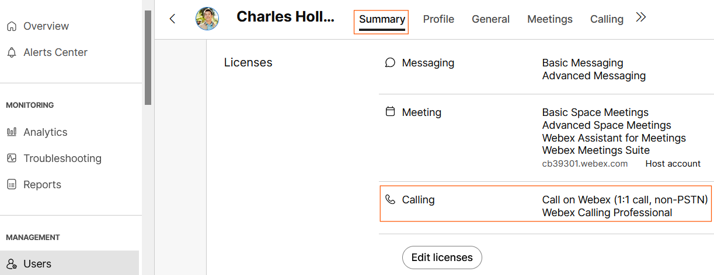

# Assigning Webex Calling Licensing users

## Assigning Webex Calling Licenses to Users

In this lab we will be using user Charles Holland (extension 6018) to make inbound/outbound calls.  Let's assign Webex Calling license and DID number to Charles.

* Continuing Workstation 1, Webex Control Hub, go to <strong>MANAGEMENT</strong> &gt; <strong>Users.</strong>

* Select <strong>Charles Holland</strong> user from the list of users.

* On the user <strong>Summary </strong>page scroll down and click <strong>Edit Licenses</strong>

* On the next page click <strong>Edit Licenses</strong> (towards the bottom right) again.

* On the next page go to the<strong> Calling</strong> tab and check mark for both options <strong>Webex Calling</strong> and <strong>Professional</strong> and Click <strong>Save</strong>.

* On the next page, in the dropdown option for Location, select <strong>dCloud</strong>. Drop down <strong>Phone Number </strong>field and select one of the PSTN Numbers available.  Select any number other than the number you have assigned as the Main Number (previous module). Populate the extension field with <strong>6018</strong> for the user. Click <strong>Save</strong>. Click <strong>Close.  </strong>

!!! note "Note"

    <strong>NOTE</strong><strong>:</strong> Note the PSTN Number you have assigned to Charles Holland in a notepad file (including country code +1) where you have all the other details of the lab. You will need this number later in the lab.

* You will be taken back to the user <strong>Summary</strong> page. Notice that under <strong>Licenses</strong>, now <strong>Webex Calling Professional</strong> has been added for the <strong>Calling</strong> service.

* This completes assigning <strong>Webex Calling licenses</strong> and <strong>DID numbers</strong> to the users.
