# Setup Call Routing

## Call Routing: Local Gateway routes calls between Webex Calling and PSTN

Once you have verified that the trunk status is Online on Webex Control Hub.  We need to configure the dial-peers on local gateway for routing calls.

Having built a trunk towards Webex Calling above, the following configuration will be used to create a non-encrypted trunk towards a SIP based PSTN provider on the LGW platform for inbound and outbound PSTN calls for Webex Calling endpoints.

!!! note "Note"

    All the commands are that are required to configure Local Gateway are put in a text file called <em><strong>Wx</strong></em><em><strong>1</strong></em><em><strong>2026-GW-Config.txt</strong></em> on workstation 1 <strong>Desktop</strong> folder.  If you are having trouble copying these commands from this document due to formatting issues, you can copy those commands from this file to <strong>Putty</strong>.  Right click on the file and click Edit with Notepad++.


* Configure the following voice class URIs for URI-based dialing.

<strong>Configuration:</strong>

```text
! - Defines ITSP’s host IP address
configure terminal
voice class uri 100 sip
host ipv4:198.18.133.3
end
```

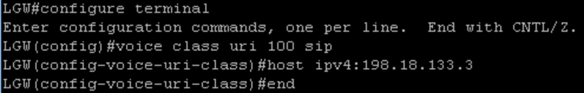

* Configure voice class uri 200 as shown.  Replace the dtg value with your pod’s dtg information.

<strong>Configuration:</strong>

! - Defines pattern to uniquely identify a Local gateway site within ! an Enterprise

```text
configure terminal
voice class uri 200 sip
pattern dtg=dcloud-trunk3718_lgu
end

```

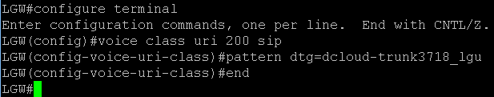


* Configure the following Pattern maps &amp; outbound dial-peers as shown below.

<strong>Configuration:</strong>

!!! note "Note"

    This is the DID number you assigned to Charles Holland during Webex Calling License assignment. If you have taken the note of the DID number when assigned, you can get it by going on to <strong>Webex Control Hub</strong> &amp; <strong>SERVICES</strong> &gt; <strong>PSTN &amp; Routing</strong> &gt; <strong>Numbers</strong> and copy the number Assigned to <strong>Charles Holland</strong><strong> (including + and country code as shown below)</strong>.

! – E164 pattern map for Webex

<em><strong>Configuration:</strong></em>

```text
configure terminal
voice class e164-pattern-map 200
  e164 +XXXXXXXXXXX        !update XXXXXXXXXXX with the DID number assigned for Charles Holland including country code
  e164 6018
end
```

! – E164 Pattern map for PSTN

```text
configure terminal
voice class e164-pattern-map 100
  e164 +91.T
  e164 +1.T
  e164 +.T
end
```

! - Outbound dial-peer towards IP PSTN

```text
configure terminal
dial-peer voice 101 voip
description Outgoing dial-peer to IP PSTN
destination e164-pattern-map 100
session protocol sipv2
session target ipv4:198.18.133.3
voice-class codec 99
voice-class sip tenant 100
dtmf-relay rtp-nte
no vad
exit
```

! - Outbound dial-peer towards Webex

```text
dial-peer voice 200201 voip
description Inbound/Outbound Webex Calling
destination e164-pattern-map 200
session protocol sipv2
session target sip-server
voice-class codec 99
voice-class stun-usage 200
no voice-class sip localhost
voice-class sip tenant 200
dtmf-relay rtp-nte
srtp
no vad
end

```

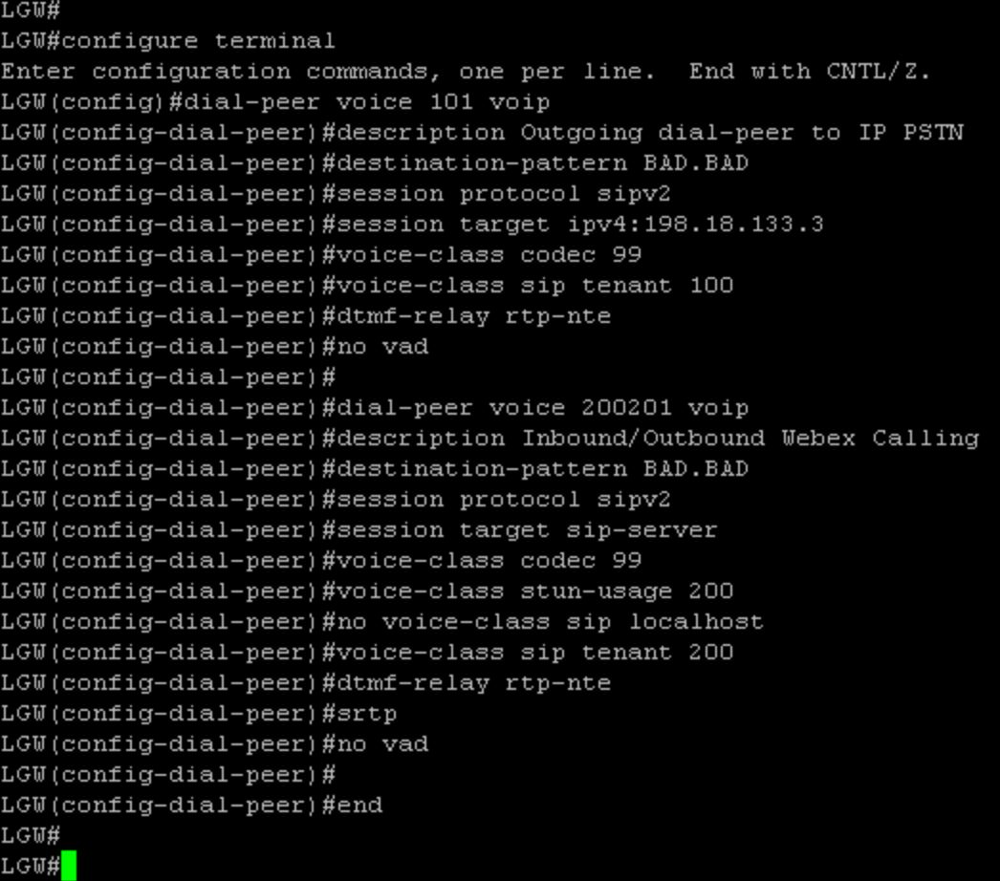

* Configure the following inbound dial-peers.

<strong>Configuration:</strong>

```text
! - Inbound dial-peer for incoming IP PSTN call legs

configure terminal
dial-peer voice 100 voip
description Incoming dial-peer from IP PSTN
session protocol sipv2
incoming uri via 100
voice-class codec 99
voice-class sip tenant 300
dtmf-relay rtp-nte
no vad
exit
```

```text
! - Inbound dial-peer for incoming WxC call legs, with the call destined for IP PSTN

dial-peer voice 200201 voip
description Inbound/Outbound Webex Calling
max-conn 250
incoming uri request 200
end

```

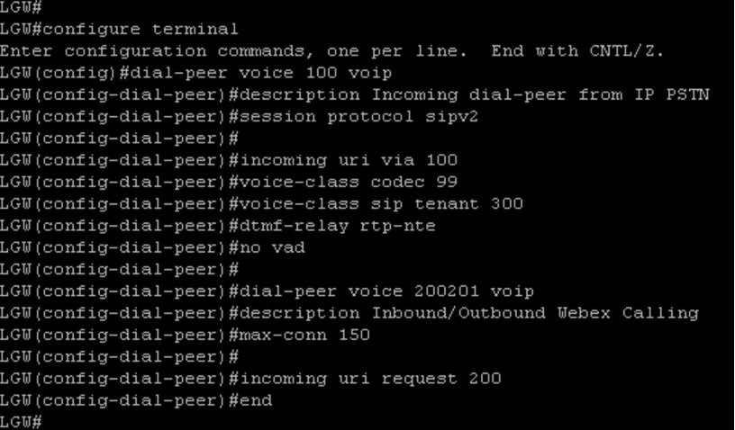

<br>

* Now, we need to define a translation rule for an inbound call.  Define the translation rule as shown below.

```text
voice translation-rule 100000
 rule 1 /6018/ /XXXXXXXXXX/ 
! update XXXXXXXXXX with the DID number assigned for Charles Holland, update it with including country code like +1 
```

!!! note "Note"

    This is the DID number you assigned to Charles Holland during Webex Calling License assignment. If you have taken the note of the DID number when assigned, you can get it by going on to <strong>Webex Control Hub</strong> &amp; <strong>SERVICES</strong> &gt; <strong>PSTN &amp; Routing</strong> &gt; <strong>Numbers</strong> and copy the number Assigned to <strong>Charles Holland</strong><strong> (including + and country code as shown below)</strong>.

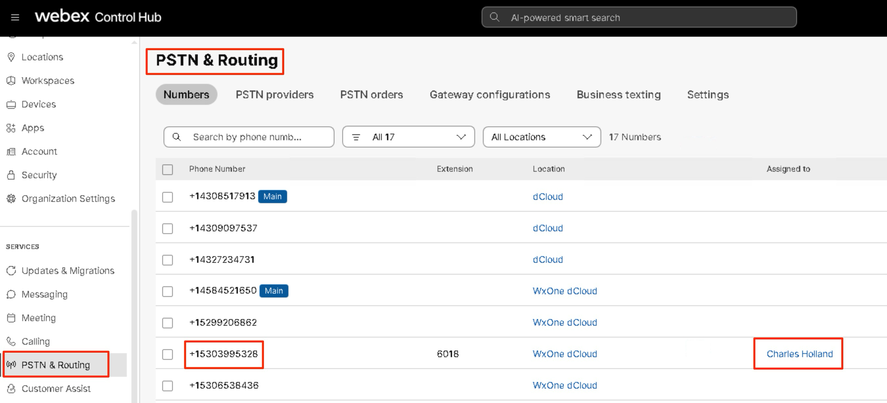

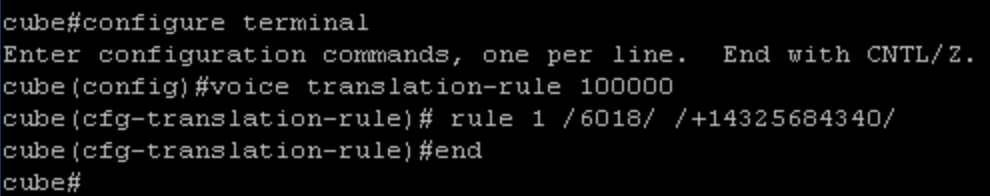

* Configure a translation profile with name <strong>Inbound\_Call</strong> and assign the translation rule we have defined above.

```text
configure terminal
voice translation-profile Inbound_Call
 translate called 100000
end
```

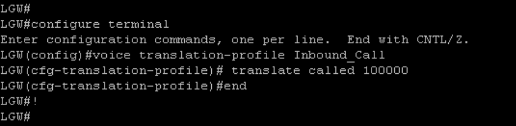

* Now we need to assign the translation profile to Inbound/Outbound to Webex Calling.

```text
configure terminal
dial-peer voice 200201 voip
translation-profile outgoing Inbound_Call
end
```

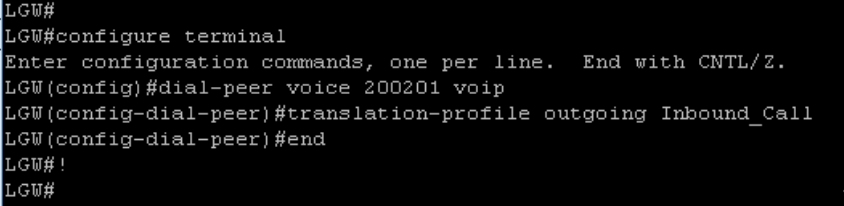

This completes configuring call routing on Local Gateway for <strong>Option 1</strong> (Local Gateway routing calls between Webex Calling and PSTN)

## Verifying trunk status on Control Hub and assigning trunk to location

* Now, let's verify the trunk status on Control Hub and assign it to location <strong>dCloud</strong>. Minimize all applications &amp; go back to the browser tab where you had <strong>Webex Control Hub</strong> Open.

* Navigate to <strong>Services</strong> &gt; <strong>PSTN &amp; Routing</strong> &gt; <strong>Gateway configurations</strong>. Select your trunk that you have defined above. On the fly-out window under Details click <strong>Trunk Info</strong>/<strong>Manage</strong>.

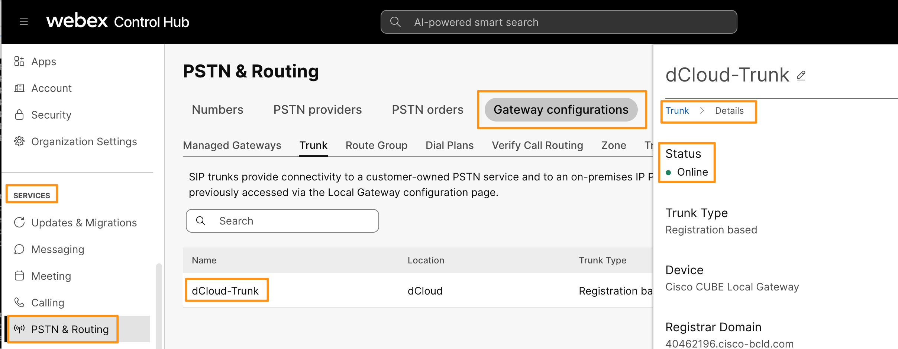

* Make sure the Trunk status on Control Hub shows <strong>Online </strong>before continuing to next section.  If the status does not show online that means, there is some configuration issue.  You need to verify your Voice Class Tenant and SIP profiles.

* Now we need to assign this trunk to the location.  Go to <strong>Management</strong> &gt; <strong>Locations.  </strong>Select the <strong>dCloud</strong> location.  on the dCloud location page, go to the <strong>PSTN</strong> tab.  On the PSTN tab click <strong>Manage</strong> under <strong>PSTN Configuration</strong> &gt; <strong>PSTN connection</strong>

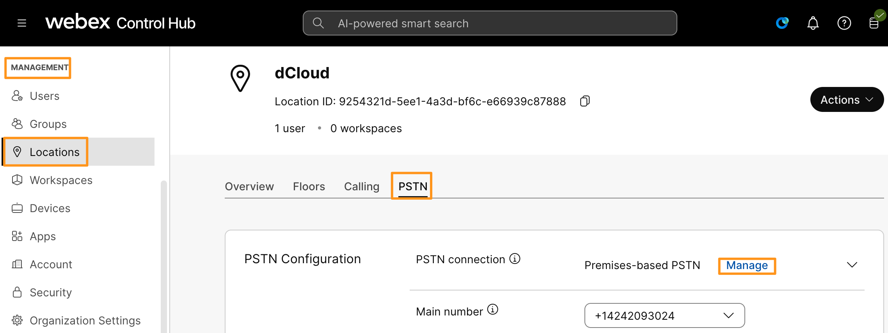

* On the following page drop down the option for <strong>Routing Choice </strong>and choose the trunk you defined.  In this lab guide, it's named: <strong>dCloud-Trunk.  </strong>Checkmark the option to confirm that you understand the impact of these changes.  Click <strong>Next</strong>.  Click <strong>Done</strong> <strong>(add numbers later)</strong> on the following page.

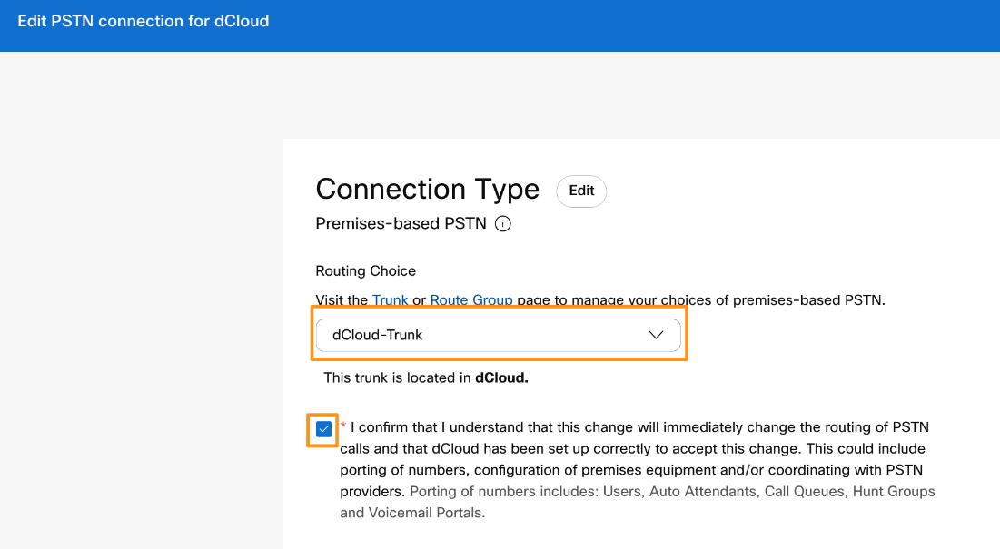

* Now just to make sure the trunk is assigned to the location, go to <strong>SERVICES</strong> &gt; <strong>PSTN &amp; Routing</strong> &gt; <strong>Gateway Configurations &gt; Trunk</strong>

* Under the Trunk tab for the dCloud-Trunk (or your trunk name) <strong>In Use</strong> column should show <strong>Yes</strong> as shown below.

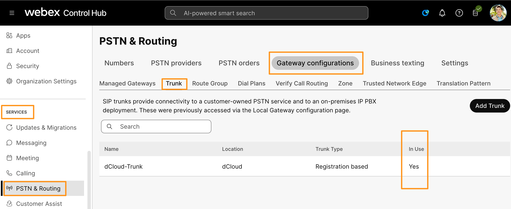

The call flow into the dCloud session works as follows:

* Call comes to a dCloud PSTN DID number from the SIP PSTN provider.

* The dCloud PSTN gateway translates that number into a four-digit extension and sends it to the Local Gateway.

- These numbers can be found in the Phone Numbers sections in your dCloud session’s details page. They can also be found on the desktop of Workstation 1 in a text file named DN\_to\_DID.txt.

- Local Gateway then routes these calls to Webex or Local Gateway

- Extensions used in the lab : 6018
