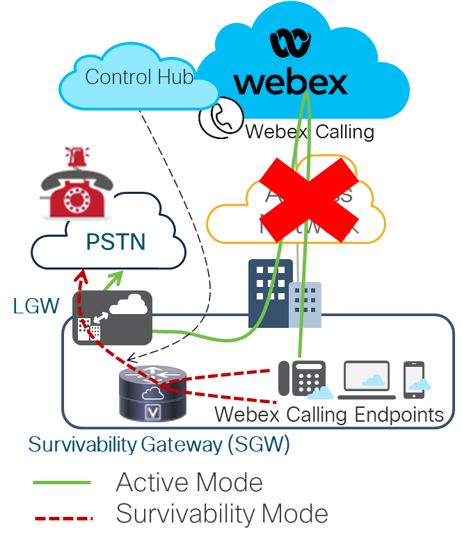

# Chapter 3 Survivability Gateway Configuration and failover verification

## Chapter 3 Site Survivability for Webex Calling

In this lab activity, you will learn how to configure <strong>Site</strong> <strong>survivability</strong> <strong>for</strong> <strong>Webex</strong> <strong>Calling</strong>.

By default, Webex Calling endpoints operate in <strong>Active</strong> <strong>mode</strong>, registered to Webex Cloud. However, if the network connection to Webex breaks, the endpoints can switch automatically to <strong>Survivability</strong> <strong>mode </strong>and register to the Survivability Gateway within the local network.

While in Survivability mode, you can still receive and make the following calls:

- Internal calls (intrasite)

- External calls (incoming and outgoing) using a local PSTN/SIP trunk

The following picture demonstrates the Survivability Mode, where access Network is down, and endpoints can still make and receive calls while registered to the Survivability Gateway (SGW) as a backup call control.

