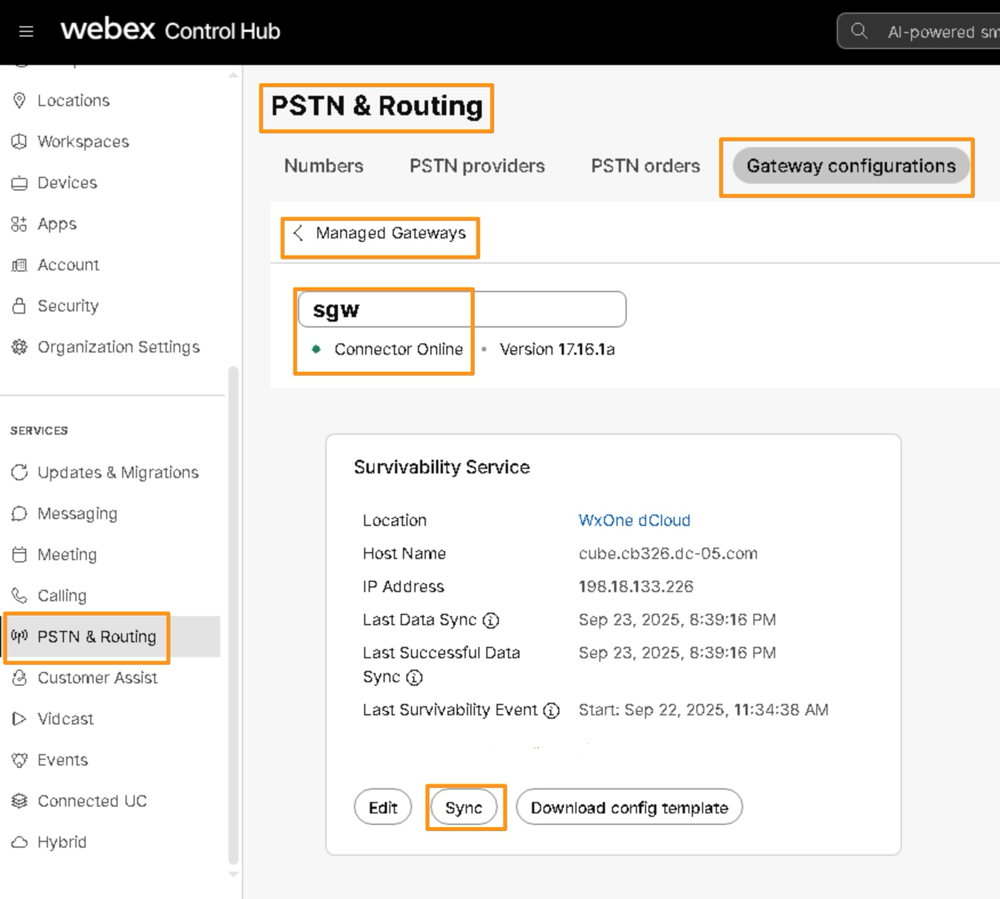
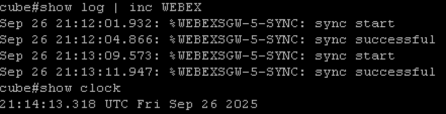
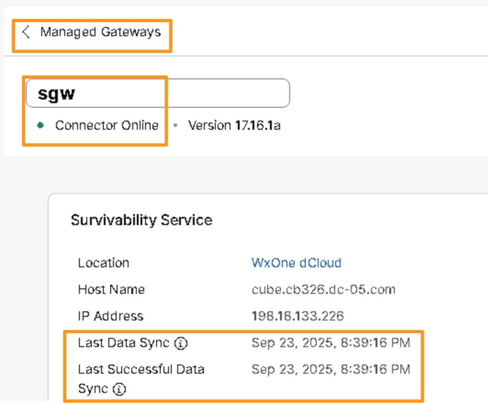

# Sync data to Survivability Gateway

## Perform Synchronization from Survivability with Webex

Now, we will initiate the data sync between Webex cloud and Survivability Gateway. This data sync includes:

- Authentication information for registered users (only valid users can register onto the SGW during the survivability event)

- Routing information for users (e.g. extensions of the users and so on)

* Continuing on Workstation 1, go back to browser tab where you have Control Hub logged in.  If the previous login timed out login as [cholland@cbXXX.dc-YY.com](mailto:cholland@cbXXX.dc-YY.com)

* On the Control Hub go to <strong>SERVICES &gt; PSTN &amp; Routing &gt; Gateway Configurations &gt; Managed gateway</strong>.  Select the only available gateway (<strong>sgw</strong>)

* It brings up sgw information page.  Click <strong>Sync</strong> to initiate the synchronization between Survivability Gateway and Webex.



* It takes around 3 to 5 minutes (max 15 minutes) for the synchronization status to reflect on Control Hub.

* Its quicker to verify the synchronization status on <strong>sgw</strong> (Survivability Gateway).  Go back to <strong>Putty</strong> session of the <strong>Survivability Gateway</strong>, log back in if the session timed out with credentials <strong>admin</strong>/<strong>dCloud123!</strong>

* On the Putty window run the following commands to check the synchronization status.  Repeat command until you see <strong>%WEBEXSGW-5-SYNC: sync successful</strong> message.

```text
show log | inc WEBEX
show clock
```



Once you see the sync successful message, the configuration of SGW is complete and is ready to serve as a survivability gateway. However you still need to wait for the Sync status to reflect on Control Hub.  Wait until the <strong>Last Data Sync</strong> and <strong>Last Successful Data Sync</strong> are reflected with the current sync date and time.


