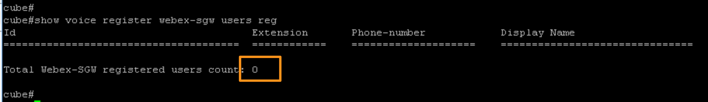
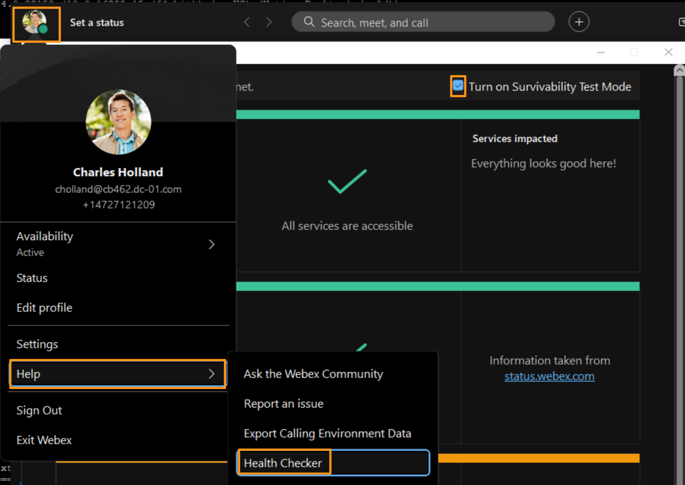
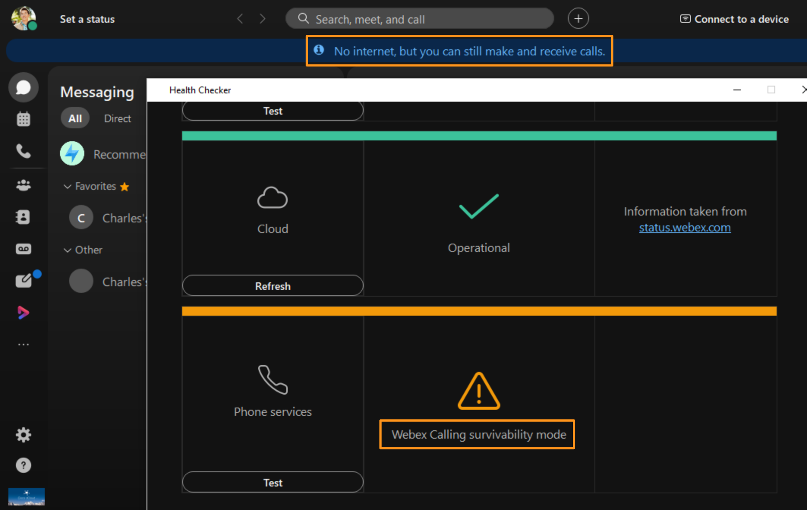
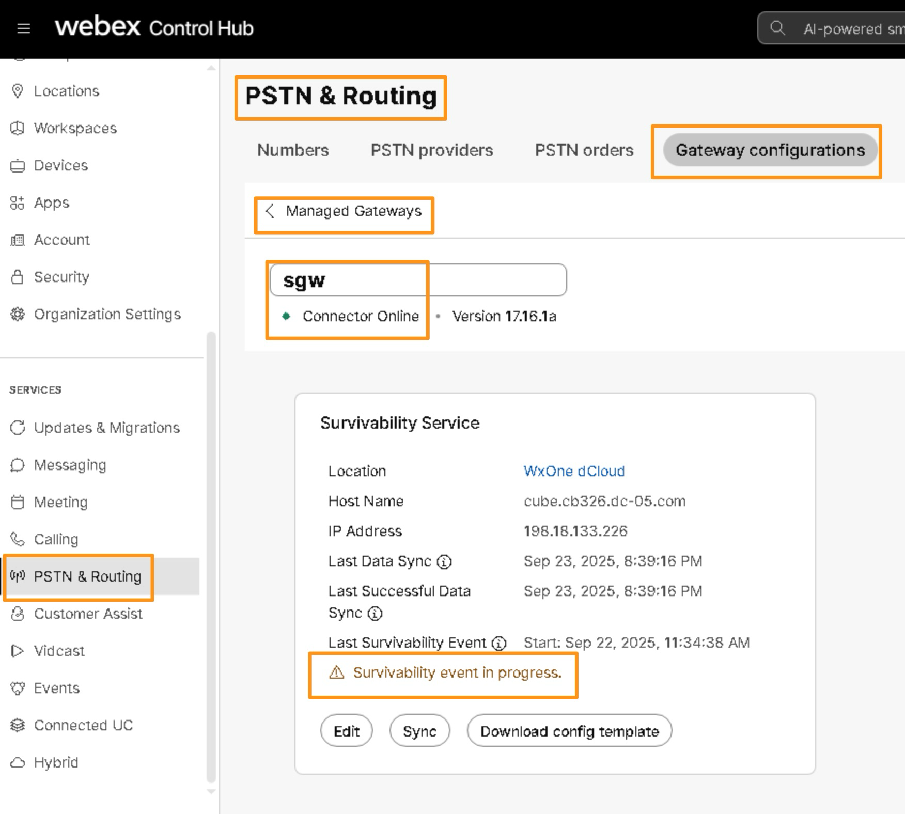
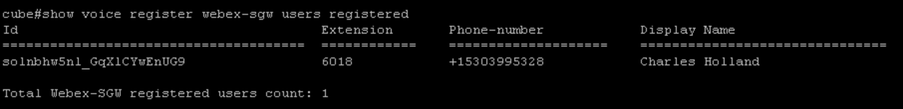
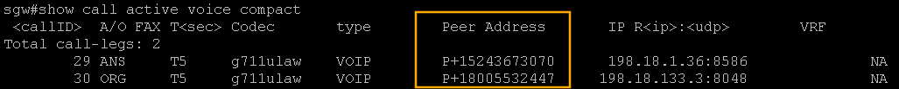
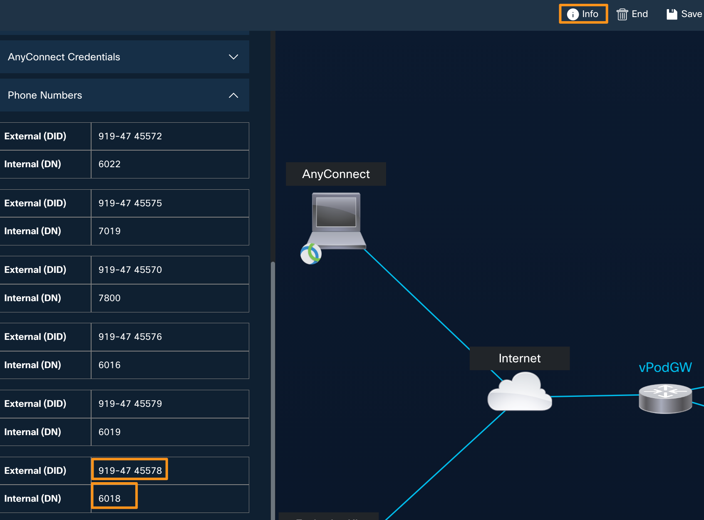
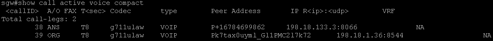

# Test Calls during Survivability event (failover)

## Test the Site Survivability

For testing the Site survivability we will manually trigger the failover so users will register to the Survivability gateway.  However before triggering the site survivability, let’s make sure that calling is working in normal mode.

* Continuing on Workstation 1.  Minimize all applications and bring up Webex.  If not already logged in, login as [cholland@cbXXX.dc-YY.com](mailto:cholland@cbXXX.dc-YY.com) &amp; dCloudZZZZ!.  Once logged in click OK for Emergency Call notification.

* Now go back to putty session where you have logged into <strong>cube</strong><strong>.  </strong>Login back in with credentials <strong>admin</strong>/<strong>dCloud123!</strong> at IP address <strong>198.18.133.226</strong> If previous login timed out.

* Run the following command to check if any users are registered to site survivability.  It should return no users as we are in normal mode (meaning calls are being routed by Webex).

show voice register webex-sgw users registered

Once the call are verified in normal mode and confirm there are currently no users registered to survivability gateway, we can trigger the site survivability.

* Go back to Workstation 1 and on the on Webex click on profile picture and go to <strong>Help</strong> &gt; <strong>Health Checker</strong>.

* On the <strong>Health Checker</strong> page, <strong>Check mark</strong> the option Turn on Survivability Test Mode on top right corner.

* Observe that once you enable <strong>Survivability Test Mode</strong>, Phone services will display <strong>Webex Calling survivability mode</strong> and there will be a banner as well with the message <strong>No internet, but you can still make and receive calls</strong>.

!!! note "Note"

    If you do not see Webex Calling survivability mode (orange banner/bar), sing out and sign back into Webex.  If it still doesn’t work, go back to Webex Control Hub, <strong>SERVICES</strong><strong> &gt; </strong><strong>PSTN &amp; Routing &gt; Gateway Configurations</strong><strong> &gt; </strong><strong>Managed gateway</strong> and select sgw gateway and start <strong>Sync</strong> process again, wait until sync process status is updated and try the Survivability Test Mode again as described above.

* Once user is enabled for site survivability, go back to browser tab where you logged into Webex Control Hub and go to <strong>SERVICES &gt; </strong><strong>PSTN &amp; Routing &gt; Gateway Configurations</strong><strong> &gt; Managed gateway</strong>.  Select the gateway <strong>sgw</strong> from list and observe that it displays a message <strong>Survivability event in progress</strong>.

!!! note "Note"

    Sometimes it may take longer to reflect the status <strong>Survivability event in progress</strong>

* Now, go back to putty session where you logged into <strong>cube</strong> and run the following command again and observe that one users is registered with site survivability gateway.

show voice register webex-sgw users registered

Now, let's test PSTN calls.  From the Webex on workstation 1, dial make an <strong>outbound</strong> call to <strong>Test Number </strong>for this lab are below depending upon your <strong>dCloud</strong> data center

<strong>RTP/SJC: +18005532447 or +16787013003</strong>

* The call should be auto answered by IVR, keep the call active for few seconds.  FYI, you don’t have to make any selections on IVR.

* While the call is active run the following command on survivability gateway.

show call active voice compact

* Now, let's try Inbound call PSTN call, from your mobile phone dial the DID number assigned to <strong>Charles Holland</strong>.  This is the same number you have noted for <strong>Charles Holland</strong> in the accessing lab section.  If you have not noted, go to <strong>Session Info</strong> tab on your dCloud session.  It will bring up a fly-out window on the left side.  Scroll down on the fly-out window to <strong>Phone Numbers</strong> section and drop down.  Note the phone number associated with extension <strong>6018</strong>. In the screenshot shown below, the number is <strong>+1-979-474-557</strong><strong>8.  </strong>This number will be different for each lab/session.  Dial the number from your own session.

* Answer the call either on Webex on Workstation 1.  While the call is active run the following command on survivability gateway.

show call active voice compact

This concludes the testing of site survivability for Webex Calling.
