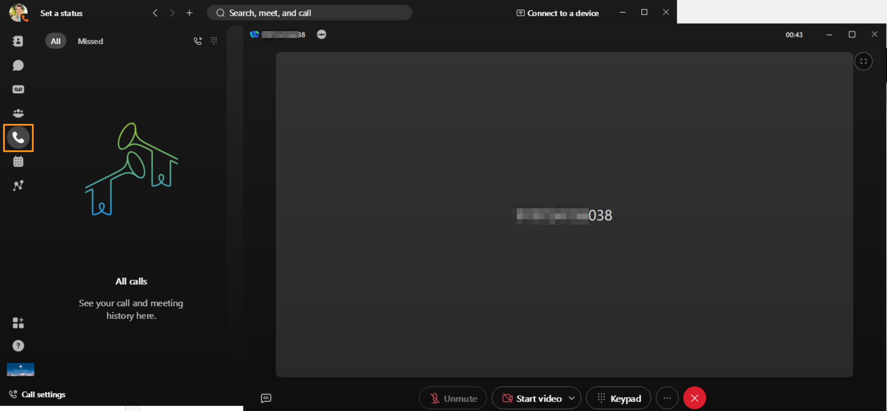
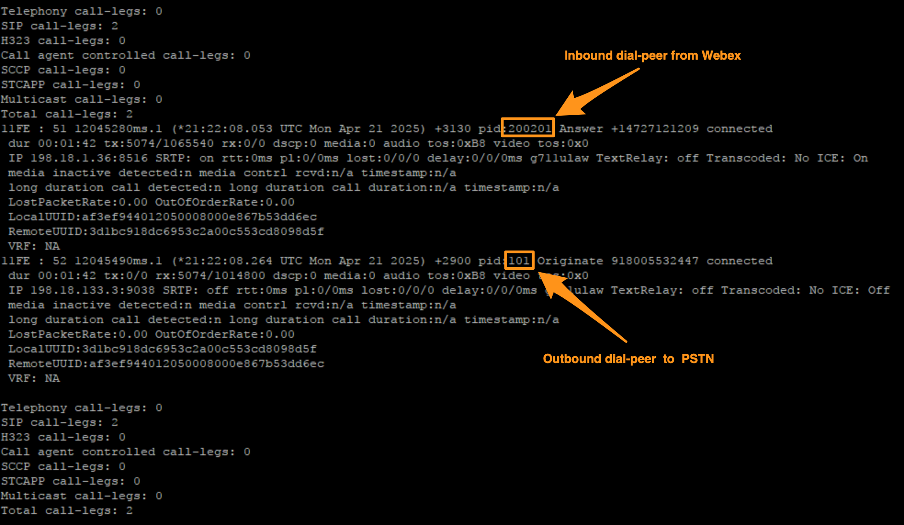
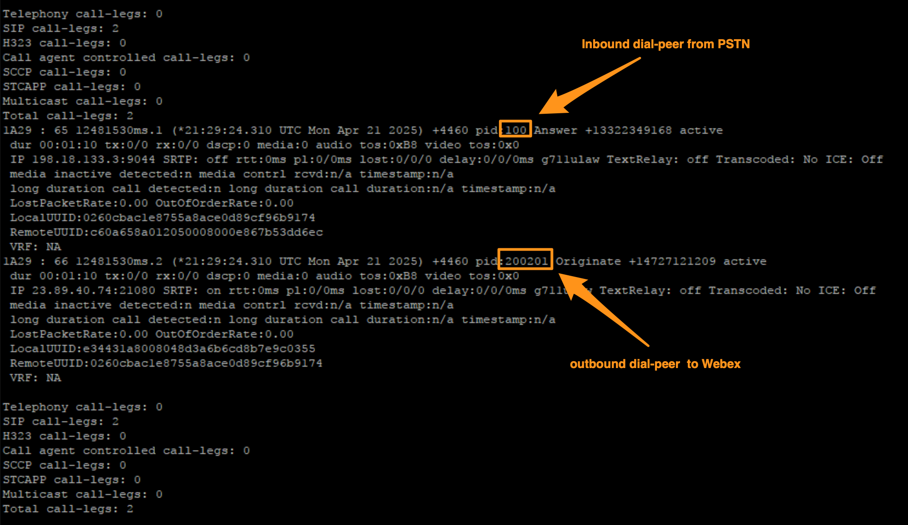

# Verify Call Routing

## Test Calls between Webex and PSTN via Local Gateway

### Outbound Call from Webex:

* Continuing on Workstation 1, minimize all the applications on the Desktop and open Webex from the Desktop.

* Login as [cholland@cbXXX.dc-YY.com](mailto:cholland@cbXXX.dc-YY.com), the credentials are in the Credential file in the Desktop.

* Click <strong>OK</strong> for the <strong>Emergency Calling Notification</strong>

* Go to <strong>Calling</strong> tab on the left side page and dial your 10-digit mobile number (if you do not have mobile phone number you can use any local number below are few test number for your reference).  <strong>Test Number </strong>for this lab are below depending upon your <strong>dCloud</strong> data center

<strong>RTP/SJC: +18005532447 or +16787013003</strong>



* The call will be answered by an IVR.  If you hear the IVR message the call is successfully connected.  FYI, you do not need to make any selection on IVR.

* <strong>Optionally</strong> you can dial your mobile phone number &amp; answer the call on your mobile.

* While the call is active run the following command on Local Gateway.  If the previous login to the gateway is timed out login back as <strong>admin/dCloud123!</strong>

```text
show call active voice brief
```

* Scroll down on the output (use space bar) towards end.  There you will see the Inbound call leg dial-peer and out bound call leg dial peer as shown below.



* Wait for a few seconds and once you verified the inbound/outbound call legs and dial-peers hang up the call.

### Inbound Call to Webex:

* Continuing on Workstation 1, from your mobile phone dial the DID number assigned to <strong>Charles Holland</strong>.  This is the same number you have noted for <strong>Charles Holland</strong> in the accessing lab section.  If you have not noted, go to <strong>Session Info</strong> tab on your dCloud session.  It will bring up a fly-out window on the left side.  Scroll down on the fly-out window to <strong>Phone Numbers</strong> section and drop down.  Note the phone number associated with extension <strong>6018</strong>. In the screenshot shown below, the number is <strong>+1-979-474-557</strong><strong>8.  </strong>This number will be different for each lab/session.  Dial the number from your own session.


* Answer the call either on Webex on Workstation 1.

* While the call is active run the following command on Local Gateway.  If the previous login to the gateway is timed out login back as <strong>admin/dCloud123!</strong>

show call active voice brief

* Scroll down on the output (use space bar) towards end.  There you will see the Inbound call leg dial-peer and out bound call leg dial peer as shown below.



* Wait for a few seconds, once you verified the inbound/outbound call legs and dial-peers hang up the call.

We can move to the next section now.
