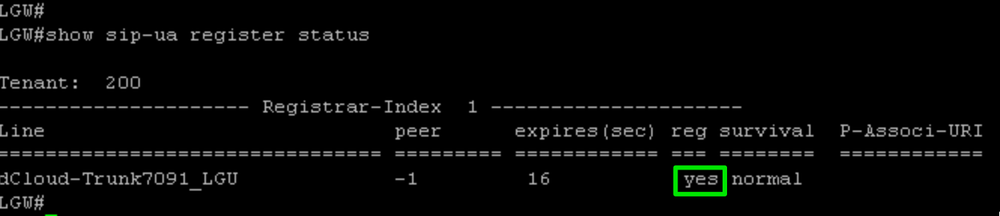

# Verifying Trunk Status

<strong>Verification</strong><strong>:</strong>

```text
show sip-ua register status
```



The status of the trunk can be seen in the output of this command, you can see here that the reg status is yes.  If you <em><strong>DO NOT</strong></em> see the reg status as <strong>yes</strong> there is something wrong with either your SIP Profiles (<strong>voice class sip-profiles 200</strong>)  or Voice Class Tenant (<strong>voice class tenant 200</strong>) verify and fix them.
