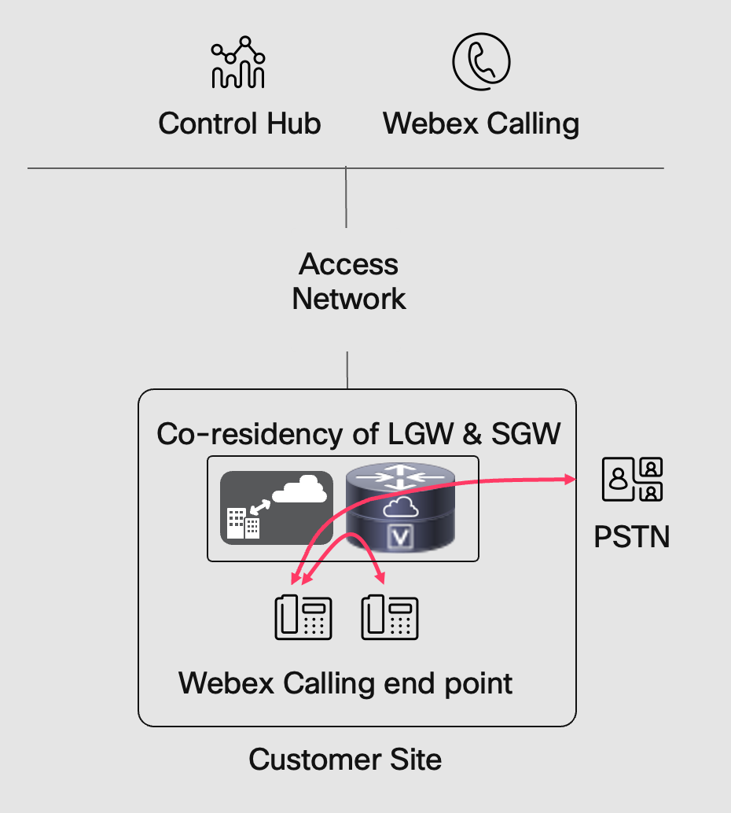

<!--
# 
Welcome!

<iframe src="https://app.sli.do/event/9FSNERWiqKg55MygtExCBX/questions" height="100%" width="100%" frameBorder="0" style="min-height: 560px;" allow="clipboard-write" title="Slido"></iframe>
-->

# About this Lab

## Making zero downtime a reality with Webex Calling

Venky Yechuri – Technical Systems Project Engineer, Collaboration

Bryan Waldmann – Leader - Solutions Engineer, Collaboration

Rajamani Nallakaruppan – Solutions Engineer, Collaboration

Webex Calling delivers 99.99% committed availability with global reach, but businesses still worry about what happens if cloud services or access networks go down. During such outages, end users may lose the ability to make internal, external, or even emergency calls, and customers may not be able to reach the business—impacting revenue.

To address this, internet redundancy is critical, with options such as redundant links, cellular failover, and decentralized internet access. Beyond connectivity, Webex Calling offers a Site Survivability solution, where a Survivability Gateway (SGW) at the customer site ensures uninterrupted calling. In case of a network outage, both internal/external calls and emergency calls are routed via the SGW.

In this lab, you will provision and configure a Local Gateway (for PSTN access) and a Survivability Gateway (for zero-downtime calling). The Survivability setup will be co-resident on the same router as the Local Gateway, showcasing a complete, resilient solution for Webex Calling.

In this lab, you will work with a single Catalyst 8000v router where both the Local Gateway (LGW) and Survivability Gateway (SGW) are co-resident. You will first configure the device as a Local Gateway for Webex Calling and verify PSTN calling functionality. Next, you will enable the Survivability Gateway on the same router. Finally, you will simulate a failover event to validate survivability and confirm PSTN call continuity.
